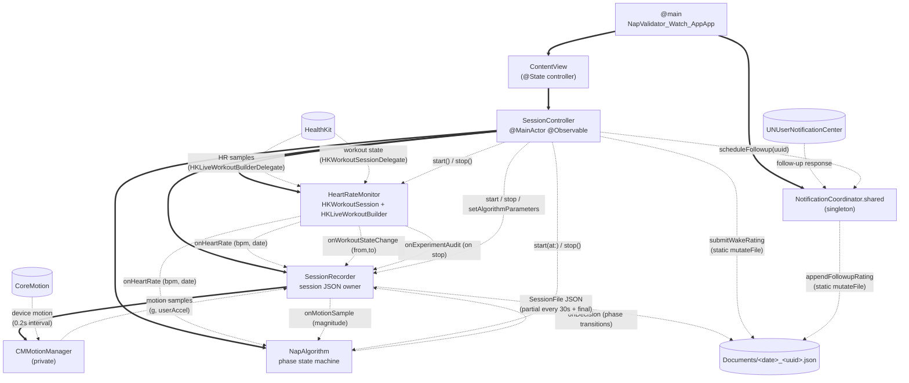

# NapValidator Watch App — Architecture

## Legend

- **Thick solid arrows** (`==>`) — ownership: A holds a strong reference to B (stored property, `@State`, singleton bootstrap).
- **Dashed arrows** (`-. label .->`) — runtime data flow: what data moves from A to B during a session, labeled with what's flowing.
- **Cylinders** — external systems (HealthKit, CoreMotion, UNUserNotificationCenter) and the on-disk JSON file.

## How a session runs

`NapValidator_Watch_AppApp.init` bootstraps the `NotificationCoordinator` singleton (registers the 4-action follow-up category, sets the UN delegate) and then renders `ContentView`, which lazily constructs a `SessionController`. `SessionController.init` wires its three owned components — `HeartRateMonitor`, `SessionRecorder`, `NapAlgorithm` — into a callback fan-out: HR from the monitor goes to both recorder (storage) and algorithm (Phase 1/2/3 evaluation); motion samples produced by the recorder's `CMMotionManager` are also forwarded to the algorithm as scalar magnitudes; algorithm decisions flow back into the recorder. On **Start**, the controller starts the recorder (which begins motion sampling + a 30 s partial-flush task), starts the algorithm state machine, then awaits the monitor's async start (HK authorization → `HKWorkoutSession` start → immediate pause to suppress ring credits). On **Stop**, the controller halts each component in order, the recorder serializes the final `SessionFile` JSON to Documents, and the UI flips to `.awaitingRating`; once the user picks a wake rating, the controller mutates the file in place and schedules a 3-hour follow-up notification whose response — routed back through the coordinator — appends the follow-up rating to the same file via `SessionRecorder.appendFollowupRating`.

## Diagram

## Files in the app

- **NapValidatorApp.swift** — `@main` entry point; `init()` calls `NotificationCoordinator.shared.bootstrap()`, then presents `ContentView` in a `WindowGroup`.
- **ContentView.swift** — SwiftUI view that owns the `SessionController` via `@State`, renders monitor status / sample count / latest HR / start-stop button, and presents the wake-rating sheet when the controller phase is `.awaitingRating`.
- **SessionController.swift** — `@MainActor @Observable` orchestrator; instantiates and holds `HeartRateMonitor`, `SessionRecorder`, `NapAlgorithm`, wires their callbacks in `init`, drives the `Phase` state machine (`idle` → `starting` → `recording` → `stopping` → `awaitingRating`), and on rating submission mutates the JSON file and schedules the follow-up.
- **HeartRateMonitor.swift** — `@Observable NSObject` that drives an `HKWorkoutSession` + `HKLiveWorkoutBuilder` configured for `.mindAndBody`, immediately pauses after start to suppress ring credits, forwards HR samples and workout-state changes via callbacks, and on stop deletes the workout + active-energy samples from HealthKit and emits an `ExperimentAudit` summary.
- **SessionRecorder.swift** — `@MainActor @Observable` session aggregator; owns the session UUID, `CMMotionManager` updates (0.2 s interval, computes scalar magnitude for the algorithm), screen / wrist-orientation / workout-state / algorithm-decision events, partial-flush task (every 30 s), and the static `write` / `mutateFile` / `appendFollowupRating` / `appendExperimentAudit` API.
- **NapAlgorithm.swift** — `@MainActor @Observable` wake-trigger state machine (`settling` → `asleep` → `confirming` → `wakeFired`, currently observe-only); ingests HR samples and motion magnitudes, emits `Decision` entries via `onDecision`, exposes `Parameters.current` (v0.1.2, includes Phase 1 motion-stall logging).
- **NotificationCoordinator.swift** — `@MainActor NSObject` singleton; bootstrapped from the `App`'s init; owns notification authorization, the `FOLLOWUP_RATING` category (4 actions), schedules the 3-hour post-wake `UNTimeIntervalNotificationTrigger`, and as `UNUserNotificationCenterDelegate` routes the user's response onto the matching session JSON via `SessionRecorder.appendFollowupRating`.
