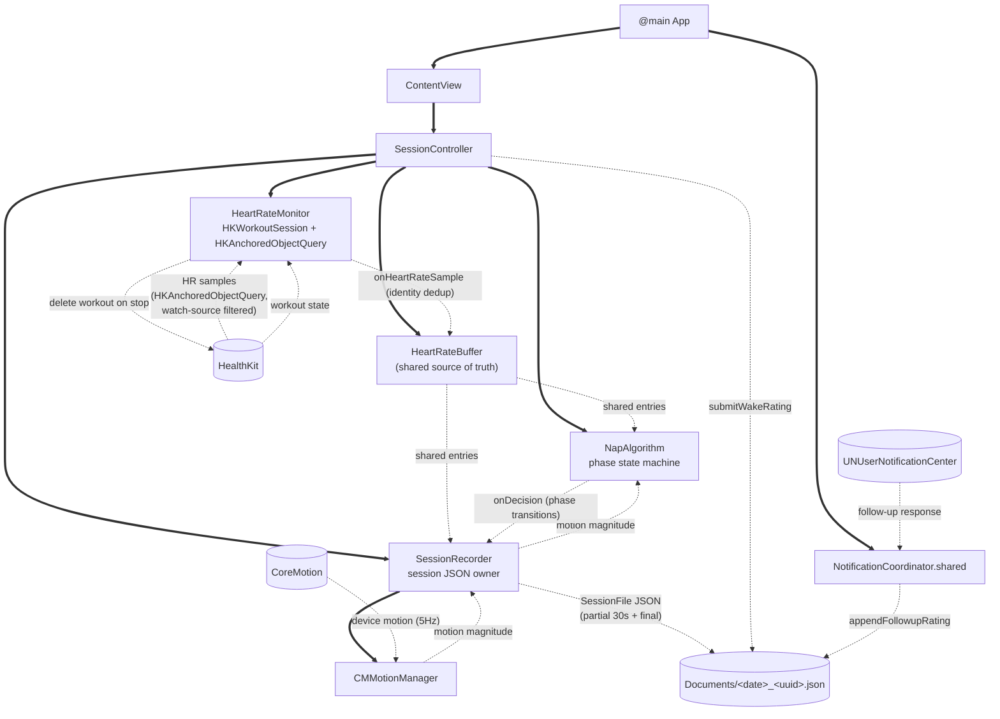

# Power Nap App — Product Document

*Last updated: May 26, 2026*

---

## 1. Current State

**Architecture (validated):**
- Continuous HR + HR SD + motion monitoring drives wake decision; wake fires before Deep sleep entry; back-by time acts as scheduling fail-safe
- HR-based stage detection validated against Apple Sleep stage labels (3 of 4 hypotheses confirmed overnight, with caveats; see Validation Findings)
- Sampling: HKWorkoutSession in `.running` state with `.mindAndBody` activity type delivers ~12 HR samples/min and 5Hz motion
- Layer A (NapAlgorithm.swift, v0.2.0, observe-only) and Layer B (SessionRecorder.swift) both shipped and integrated, plus the shared HeartRateBuffer.swift (May 21)

**Current build state:**
- **HR ingestion rewrite committed and validated May 21 (v0.2.0).** Replaces `mostRecentQuantity()` polling (which collapsed distinct HR samples onto shared timestamps) with: `HKAnchoredObjectQuery` ingestion, a single shared `HeartRateBuffer` feeding both algorithm and recorder, identity-based dedup (keyed on `HKQuantitySample.uuid`), and a watch-source filter. Validated across three on-device tests (see Validation Findings 8a). New file: `HeartRateBuffer.swift`.
- **Pause-immediately re-enabled as ship mechanism, validated May 21.** Was removed, then rejection reversed, now confirmed: protects rings (Test 2: ~0 exercise minutes, negligible basal kcal) AND delivers clean ~12/min HR under pause. The ring constraint is beaten, not merely disclosed.
- **Workout entry now deleted on stop (May 21 — reverses prior persist decision).** The persist-the-workout decision was made under the assumption that ring impact was unavoidable (the entry served as a user audit trail for ring credit). Paused mode eliminated the ring impact, so the entry became clutter rather than audit. Delete code re-added (workout-object only; energy/exercise samples are not third-party-deletable and are near-zero under pause). See 5b for the full reversal trail.
- Algorithm version 0.2.0 (ingestion rewrite); motion-HR coupling hypothesis falsified May 21 — HR capture is independent of motion delivery (code-level confirmed).
- Algorithm remains observe-only until 5-10 clean sessions confirm parameter trustworthiness.

**Actively testing / immediate next:**
- Multi-session accumulation of clean paused naps (toward 5-10 for parameter confidence; ingestion now produces clean data)
- Deepening detection in real naps (Phase 2b/3 logic, observe-only)
- **Shape-hypothesis analysis** — the original goal that the ingestion detour preempted; now unblocked (clean recovered overnight data exists, and the fixed capture path produces clean data going forward). See Open Questions.

**Parked, not blocking:**
- 5th outcome screen ("Restless/Interrupted") — waiting for 10+ sessions to reveal real patterns
- In-nap UI implementation (black-screen + wrist-raise reveal pattern designed)
- Notification alert presentation issue (delivers silently, no haptic)
- Back-by timer wiring and testing
- Second-person testing logistics
- Post-stop HealthKit drain (Step 2 — deferred; would write authoritative HR to a separate field as self-checking QA, never overwriting live capture, never feeding the algorithm)

**Open architectural questions:**
- **Bug B — overnight backgrounded sample loss (still open, not targeted by the May 21 fix).** Backgrounded sessions under Sleep Focus dropped ~77% of samples via the old delegate path. The anchored-query fix eliminates one failure mode (delegate batching) but does not itself enable background delivery — it relies on the workout session keeping the app alive. Untested under Sleep Focus. Lower priority: daytime naps (the product use case) run foregrounded/DND.
- ~~Whether motion is needed at all post-fix, or whether Phase 1 onset can run HR-only~~ **RESOLVED May 25 — Phase 1 onset MUST run HR-only.** Motion was confirmed to throttle to ~0 within ~5 min of stillness in real nap conditions (see §4 → Motion delivery throttling), so it cannot be a dependable onset-gate term; the motion-RMS term comes out of the onset gate and motion collection can be dropped. This **promotes onset detection to the product spine** (see §9).
- ~~**Algorithm-shape hypothesis — PARTIALLY ANSWERED May 21 (analysis on 2 deprived overnights): the current trigger SHAPE is structurally misaligned.**~~ **SUPERSEDED May 25 — the deepening-trigger approach is ABANDONED, not revised (see §9).** The May 25 detector-feasibility investigation closed the question this bullet was probing: no real-time Deep-detector (hand-tuned or learned) is viable on ~5 s averaged HR, so the dual-AND-sustained trigger is dropped rather than reshaped and the product pivots to a personalized timer (§9). Original analysis preserved below as the trail that led there — The dual "HR drops ≥5 below Light-ref AND rolling-60s HR-SD < 0.8, sustained 60s" gate was tested against scored Deep in the two genuine labeled overnights (AB2FFBAD, 8C86E7F9). Findings: (1) **`t_var=0.8` is NOT below the floor** — it sits at the Deep SD *median* (0.83 pooled), so the morning's "0.8 is unreachably low" worry is falsified; (2) BUT SD<0.8 is a **poor Deep/Core discriminator** — ~23% of Core (Light) windows also clear it, so the feature doesn't cleanly separate the states; (3) **no synchronous HR/SD inflection** at Apple's Deep-onset boundary to exploit (synchrony hypothesis unsupported); (4) real **sub-minute SD volatility** inside Deep (consistent with CAP arousals), but lengthening the sustain window makes yield *worse*, not better — 60s is already the yield max; (5) **integrated trigger replay detects only ~25% of scored-Deep stretches, fires ~2 min late, more false fires than true.** Cross-cutting read: the AND-of-both-sustained shape fights the physiology — not a parameter-tuning problem. **Trigger redesign is indicated but NOT yet done; the right replacement shape is an open question requiring its own design work AND rested-physiology data before committing.** See Validation Findings 8d for the full analysis and the robust-vs-soft breakdown. **No parameter values are set or recommended by this analysis** (n=2, same subject, both deprived; Q4 used a reference proxy, not a real Phase-2a capture).
- Watch-source filter resolution depends on a watch HR sample existing in the last hour (falls back to unfiltered otherwise); robust for the common case but see Platform Constraints for the edge.
- Whether Light reference SD diagnostic threshold (1-3 bpm healthy range) is reliable across users
- Whether algorithm parameters tuned to current-user physiology generalize

**Strategic posture:**
- Direct competitive comparison: PowNap (solo dev, minimal footprint, narrower product promise — HR-onset wake vs our Light→Deep deepening detection). Existence proof that HKWorkoutSession + disclosure pattern survives App Review.
- **Potential differentiation — ring protection (HYPOTHESIS, not yet a confirmed claim).** PowNap and other HKWorkoutSession-based nap apps run unpaused and accept ring corruption, disclosing it to users. Paused mode (validated May 21) appears to deliver the same high-resolution HR *without* corrupting ring data. If durable, this is a real differentiator landing precisely on the optimizer/knowledge-worker buyer who also cares about Activity rings. **The likely edge is not the pause technique itself** (publicly documented; we got it from online resources) **but having debugged past the timestamp-collapse artifact that makes pause appear to break HR capture** — the same wrong conclusion we held May 17-19 and reversed May 21. **Open caveats before this becomes a public claim:** (1) n=1 ring validation; (2) durability unknown — whether Apple's pause-ring-suppression is intended-and-stable or incidental-and-closeable in a future watchOS; (3) unconfirmed *why* PowNap accepts the impact — did they hit the same apparent-breakage and give up (good for us), or reject pause for a downside we haven't found (a trap)? Validate via multi-session testing + Apple pause-behavior documentation before relying on it in positioning. Defer full treatment to the dedicated positioning session.
- Not competing with: passive Apple Sleep data consumers (Pillow, AutoSleep, NapBot) — those apps cannot deliver real-time wake-at-moment behavior because Apple does not produce stage labels for naps.

---

## 2. Product Concept & Positioning

> **Note:** This section reflects current working thinking and has not been deeply pressure-tested. A dedicated positioning work session is needed before locking naming, onboarding, pricing, or marketing copy. Inputs to that session should include: hands-on use of PowNap and other competitive apps, fresh-eyes critique of the current framing, and external research on knowledge-worker nap behavior. Do not treat the below as settled.
>
> **CLARIFY May 26 — the personalized-timer pivot this section describes is a CANDIDATE direction, not a validated product.** Last night's pivot language (here and in the Promise below) frames an onset-anchored personalized timer + ML onset-detection as *the* product. The May 26 mechanism-feasibility study (§10) characterized that mechanism — **buildable but modest** — and left the **build/no-build decision OPEN** pending field validation. Treat §2 as the candidate/vision direction the product is *pointed at*, not a settled product. The original framing is preserved as the trail; this note only recharacterizes its certainty. See **§10**.

### Promise

> **PROVISIONAL — supersedes the precision promise (May 25); pending the positioning session.** The original promise — *"We don't time your nap. We read your body and wake you exactly when it tells us to."* — made a **precision claim** ("wake you exactly when") that the May 25 detector-feasibility investigation showed the hardware cannot support: ~5 s averaged Apple-Watch HR cannot detect the descent toward Deep precisely enough to time a wake live (see §9). The replacement below is mechanism-true personalized-timing language with **no real-time-precision claim**. It is a draft — consistent with this section's "not settled" caveat, it awaits the positioning session before locking.

We learn *your* nap — how fast you drift off and how long until your sleep deepens — and time your wake to your own rhythm, not a generic alarm.

### Positioning

Productivity tool, not wellness app. Competitive set is coffee and energy drinks, not Calm or Headspace. Visual and copy register: dark UI, scientific framing, no meditation/breathing/calm language.

### Target user (working hypothesis)

Knowledge worker with afternoon meetings, flexible mid-day schedule, owns an Apple Watch. Values productivity output over wellness aesthetics. Currently relies on coffee or naps timed by phone alarm; both approaches produce inconsistent results.

### Strategic framing

The product wins on wake decision quality, not on category presence. Apple's first-party Sleep app handles overnight tracking; passive consumer apps (Pillow, AutoSleep, NapBot) handle post-hoc analysis. The unoccupied space is real-time wake-at-optimal-moment for naps — a promise no current incumbent delivers.

---

## 3. System Architecture

### Terminology note

This system measures HR sample standard deviation (HR SD) — the spread of HR values across a rolling window. This is distinct from true Heart Rate Variability (HRV), which measures beat-to-beat interval timing and requires HKHeartbeatSeries access (unavailable to third-party workout sessions, see May 14 finding). When this document refers to variability, it means HR SD unless explicitly stated otherwise.

### High-level model

Continuous HR + HR SD + motion monitoring drives a wake decision. Wake fires when Light sleep signals begin deepening toward Deep — before Deep sleep entry. A user-set back-by time acts as scheduling fail-safe.

### Sampling

- **Mechanism:** HKWorkoutSession in `.running` state with `.mindAndBody` activity type
- **HR delivery:** ~12 samples/min via HKLiveWorkoutBuilder
- **Motion delivery:** 5Hz via CMDeviceMotion
- **Wrist orientation:** Derived from gravity vector
- **Activity ring impact:** Unavoidable; disclosed in onboarding and App Store description

### Stage taxonomy

| User-facing label | Internal label | Meaning |
|---|---|---|
| Drifting | N1 | Counts as sleep |
| Light | N2 | The productive zone |
| Deep | N3 | The zone to avoid |

Internal labels (N1/N2/N3) are scientific reference only, never shown to users.

### Sleep onset and duration

- **Sleep Onset** = time from "Start nap" → entering Drifting
- **Nap Duration** = time in Drifting + time in Light
- **Session length** = Sleep Onset + Nap Duration (not displayed as primary stat)

### Algorithm structure (Layer A)

> **SUPERSEDED May 25 — the deepening-trigger approach (Phase 2a/2b/3) is ABANDONED, not revised (see §9).** The May 25 detector-feasibility investigation found no viable real-time Deep-detector on ~5 s averaged HR; the product pivots to a **personalized timer driven by ML onset-detection** (§9e). The phase machine below is preserved as the **design record** of the dropped deterministic trigger — it is **no longer the live approach** and is no longer "observe-only awaiting trust"; it is retired. **The exception is Phase 1 (onset detection): it survives and is promoted to the product spine** (it anchors the personalized timer). Phase 2a/2b/3 (Light-reference capture + deepening trigger + confirm) are the abandoned part.

Three-phase state machine (original design record; Phase 2a/2b/3 abandoned May 25, Phase 1 retained — see banner above).

**Algorithm inputs:**
- HR samples (timestamps + BPM) — used to compute both rolling HR mean and rolling HR SD
- Motion samples (magnitude) — used for Phase 1 onset trigger only; Phase 2b/3 are HR-only

Phase 2b/3 are HR-only by design. Motion stalls after Phase 1 (a known platform behavior under stillness) do not affect deepening or confirmation logic.

> **Update May 25 — Phase 1 onset to become HR-only.** Motion was confirmed to throttle to ~0 within ~5 min of stillness in real nap conditions (see §4 → "Motion delivery throttling"), so the Phase 1 onset gate's motion-RMS term is **not dependable** and is slated for removal — onset detection runs HR-only going forward (matching Phase 2b/3). The motion input above describes the current v0.2.0 code, which still carries the motion term until that change lands. Post-pivot (see §9) onset detection is the product spine, so reliable HR-only onset is now load-bearing.

**Phase 1: Settling**
- Captures awake reference HR (median of first 180s)
- Onset triggers when rolling 90s HR ≥ 2 bpm below awake reference AND motion RMS < 0.005 g, sustained 90s
- Transitions to Phase 2a

**Phase 2a: Light reference capture**
- 180s window after onset
- Captures Light reference HR and Light reference SD
- **Light reference HR is the algorithmic pivot** — Phase 2b decisions are anchored to this value
- **Light reference SD is the quality check** — used diagnostically to assess whether the capture window landed in stable Light sleep (expected range 1-3 bpm)

**Capture quality and contamination:**

A contaminated Light reference (SD outside the 1-3 bpm range) anchors Phase 2b's trigger to a non-stable physiological state:
- SD < 0.5 bpm → user was already deepening during capture → Light reference HR is artificially low → Phase 2b trigger needs HR to drop further than physiologically realistic → trigger may never fire even when user enters Deep
- SD > 3 bpm → user wasn't stable yet → Light reference HR is artificially high → Phase 2b trigger fires too easily → false wake before user reaches productive Light depth

Current handling: SD remains purely diagnostic; contaminated sessions are allowed to proceed and their outcomes surface in post-session wake ratings.

**Phase 2b: Deepening monitoring**
- Rolling 60s HR ≤ Light reference HR - 5 bpm AND rolling 60s HR SD ≤ 0.8 bpm
- Pattern must sustain 60s
- Transitions to Phase 3

**Phase 3: Confirming**
- Same deepening condition must persist 30s
- Confirms → fires wake decision
- Pattern reverses → returns to Phase 2b

### Session termination

A nap session ends via one of four mechanisms only. The algorithm does not have an explicit awake-state — there is no Phase 4 that detects user wake mid-session and ends the nap accordingly.

1. **Algorithm fires wake decision.** Phase 3 confirms deepening; the system triggers wake.
2. **Back-by timer fires.** User's set back-by time reached before deepening was detected.
3. **User taps Stop.** Manual termination via the wrist-raise minimal status view.
4. **User closes the app.** Treated equivalently to manual Stop; session ends with end cause logged accordingly.

These four mechanisms cover all observed user behaviors: woken by the system, capped by the schedule, woke up and ended manually, or woke up and closed the app without explicit interaction.

### Threshold design: relative HR, absolute SD

> **SUPERSEDED May 25 — Phase 2b's deepening trigger is ABANDONED, not revised (see §9).** This section documents the threshold design of the deterministic deepening trigger that the May 25 detector-feasibility investigation retired (no viable real-time Deep-detector on ~5 s HR; the product pivots to a personalized timer, §9e). Preserved below as the design record; it is no longer the live approach. (The May 21 "Challenged/TESTED" note that follows is itself part of that trail.)

Phase 2b's trigger uses two thresholds with different anchoring:
- **HR threshold (t_hr = 5 bpm) is relative** — measured against Light reference HR captured per-session. Self-correcting to user physiology.
- **SD threshold (t_var = 0.8 bpm) is absolute** — a fixed value, not anchored to Light reference SD.

The asymmetry is intentional. Deep sleep produces low absolute HR SD across users (a physiological constant), not low SD relative to that user's Light baseline. A relative SD threshold would produce unstable triggers for users with low Light baseline variability and would be vulnerable to contamination of the SD reference. Light reference SD's role is diagnostic (quality check on capture), not algorithmic (trigger input).

> **Challenged May 21, then TESTED May 21 (see 8d).** The "physiological constant" framing and the `t_var = 0.8` value were questioned by the research synthesis, which predicted 0.8 sat *below* the N3 HR-SD floor (~2.3 bpm typical) and would gate out legitimate Deep. **That specific prediction was falsified by the analysis:** in this user's scored Deep, 0.8 sits at the *median* (0.83), not below the floor. BUT the analysis surfaced a different and more fundamental problem the synthesis didn't predict: SD<0.8 is a **poor Deep/Core discriminator** (23% of Core also clears it), there is no synchronous HR/SD inflection to exploit at Deep onset, and the integrated dual-AND-sustained trigger detects only ~25% of scored Deep, late and unreliably. So the *threshold value* is roughly physiological, but the *trigger shape* (absolute-SD AND relative-HR, both sustained) is structurally misaligned. The redesign question is open; no new `t_var` value is justified by n=2 deprived data. Do not change parameters on this analysis; the indicated work is shape redesign with rested data. (Note: the research synthesis remains a deprived-physiology caveat — these absolute SD values are HRV-suppressed; rested data would shift the distribution right, making the *discrimination* problem worse, not better.)

### Data recording (Layer B)

Captures per session:
- HR samples (timestamps + BPM)
- Motion samples (CMDeviceMotion at 5Hz)
- Wrist orientation changes
- Screen wake/sleep events
- Session boundaries with end cause
- Battery levels at start and end
- **Workout state transitions:** HKWorkoutSessionState changes (notStarted → running → paused → ended). Instrumentation to verify session behaves as designed and detect platform-level anomalies.
- **Experiment audit:** Structured block per session capturing architecture invariants — `pausedImmediately` (now **true** in the adopted paused-mode architecture; was false during the May 17-19 unpaused interval), `activeEnergyBurnedSampleCount`, `activeEnergyBurnedTotalKcal`, `appleExerciseTimeSampleCount`, `appleExerciseTimeTotalMinutes`. Ongoing validation that the architecture behaves as designed.
- **Build marker:** `buildMarker` field identifies which code version produced each session JSON (added May 21). Every session is self-identifying — analysis can confirm which build generated a dataset rather than assuming. *(Note: committed code currently carries a test-style marker string; consider setting a clean version marker for production.)*
- Algorithm decisions (phase transitions, motion-stall events)
- Immediate wake rating (Sharp/Fine/Groggy/Worse)
- 3-hour follow-up rating

Storage: One JSON per session, partial flushes every 30 seconds. Filename pattern: `YYYY-MM-DD_<8char>.json`.

### Component wiring & data flow (merged from ARCHITECTURE.md, May 21)

*This subsection was previously a standalone `ARCHITECTURE.md`; merged here May 21 to keep one current-truth doc and corrected to the post-ingestion-rewrite architecture. The standalone file is archived.*

**How a session runs.** `NapValidatorApp.init` bootstraps the `NotificationCoordinator` singleton, then renders `ContentView`, which constructs a `SessionController`. `SessionController.init` owns and wires three components — `HeartRateMonitor`, `SessionRecorder`, `NapAlgorithm` — plus a shared `HeartRateBuffer`. HR flows from the monitor's `HKAnchoredObjectQuery` into the shared buffer; the buffer feeds both the algorithm (Phase 1/2/3 evaluation) and the recorder (storage) from one source of truth. Motion samples from the recorder's `CMMotionManager` are forwarded to the algorithm as scalar magnitudes. Algorithm decisions flow back into the recorder. On **Start**, the controller starts the recorder (motion sampling + 30s partial-flush task), starts the algorithm, then awaits the monitor's async start (HK auth → `HKWorkoutSession` start → **immediate pause to suppress ring credits** → anchored query begins). On **Stop**, components halt in order; the recorder serializes the final JSON; the workout entry is **deleted from HealthKit** (after the audit reads energy/exercise); the UI flips to `.awaitingRating`; the wake rating mutates the file and schedules a 3-hour follow-up notification routed back through the coordinator.

**Files (current):**
- **NapValidatorApp.swift** — `@main`; bootstraps `NotificationCoordinator.shared`, presents `ContentView`.
- **ContentView.swift** — owns `SessionController` via `@State`; renders status / sample count / latest HR / start-stop; wake-rating sheet.
- **SessionController.swift** — `@MainActor @Observable` orchestrator; owns the three components + shared `HeartRateBuffer`, wires callbacks, drives the Phase state machine, handles rating submission and follow-up scheduling.
- **HeartRateMonitor.swift** — drives `HKWorkoutSession` + `HKLiveWorkoutBuilder` (`.other`), pauses immediately to suppress ring credits, runs the `HKAnchoredObjectQuery` for HR (watch-source filtered), forwards samples via `onHeartRateSample`, and on stop captures the workout, runs the ExperimentAudit, then **deletes the workout object** from HealthKit.
- **HeartRateBuffer.swift** *(new May 21)* — `@MainActor` single source of truth for HR; append-only ordered `entries`, identity dedup on `HKQuantitySample.uuid`, `onAppend` hook driving algorithm evaluation.
- **SessionRecorder.swift** — `@MainActor @Observable` session aggregator; owns `CMMotionManager`, event capture, partial-flush task, and the static write/mutate API; reads HR from the shared buffer (no longer maintains its own HR array).
- **NapAlgorithm.swift** — `@MainActor @Observable` wake-trigger state machine (observe-only, v0.2.0); reads HR from the shared buffer, ingests motion magnitudes, emits `Decision` entries.
- **NotificationCoordinator.swift** — `@MainActor` singleton; notification auth, the `FOLLOWUP_RATING` category, schedules and routes the 3-hour follow-up.

### Parameters (v0.2.0 — design record; deepening-trigger params abandoned May 25, see §9)

*Version note: v0.1.2 → v0.2.0 reflects the May 21 HR-ingestion rewrite (HKAnchoredObjectQuery, shared buffer, identity dedup, watch-source filter, workout-delete-on-stop). The algorithm **parameters** themselves are unchanged from v0.1.2 — the rewrite changed how HR is captured, not the phase logic or thresholds. **Note: the running code's `algorithmParameters.version` string still self-reports "0.1.2" as of session 8A5079FC — bump it to 0.2.0 as part of the build-marker/version cleanup so sessions self-identify correctly.**

| Parameter | Value | Purpose |
|---|---|---|
| awake_reference_window_s | 180 | Phase 1 baseline window |
| settling_to_asleep_hr_drop | 2 | HR drop threshold for onset |
| settling_to_asleep_sustain_s | 90 | Onset sustain duration |
| motion_threshold_rms | 0.005 | Motion ceiling for onset |
| light_reference_window_s | 180 | Phase 2a capture window |
| t_hr | 5 | HR drop threshold for deepening (relative to Light reference HR) |
| t_var | 0.8 | HR SD threshold for deepening (absolute) — **ABANDONED May 25 (deepening trigger dropped, see §9); was flagged for revision** |
| d_sustain_s | 60 | Phase 2b → Phase 3 trigger duration — **ABANDONED May 25 (deepening trigger dropped, see §9); was flagged for revision (CAP-rhythm concern)** |
| d_confirm_s | 30 | Phase 3 verification window |

> **SUPERSEDED May 25 (see §9).** These were placeholders for the deterministic deepening trigger — an approach now **abandoned, not revised** — so the deepening params (`t_hr`, `t_var`, `d_sustain_s`, `d_confirm_s`) and the Phase-2a `light_reference_window_s` are **not being tuned or trusted into an active mode**; they are kept only as the design record. The Phase-1 onset params (`awake_reference_window_s`, `settling_to_asleep_hr_drop`, `settling_to_asleep_sustain_s`) survive into the personalized timer's onset detector; `motion_threshold_rms` is slated for removal (Phase 1 goes HR-only — see §4). The earlier plan — placeholders tuned across 5–10 sessions, then flipping out of observe-only — no longer applies.

### Open architectural questions

1. **Should Light reference SD function as a validity gate?**
   Currently SD is diagnostic only. Two implementation options if we move to active gating:
   - Pre-capture stability gate: check rolling SD before starting Phase 2a's 180s window; wait for SD in 1-3 range before locking reference
   - Capture validity check with retry: run Phase 2a as designed; if SD lands outside 1-3, restart the window (bounded retries with fall-through to back-by)
   Decision deferred until 5-10 real sessions reveal how often contamination occurs in practice.

2. **Can d_confirm_s be reduced toward 0?**
   The 30s confirm exists to prevent false positives from transient HR dips. If Phase 3 rarely reverses in real-session logs, the confirmation window is pure delay pushing the user 30s deeper into the transition zone. Tune from observe-only data: if Phase 2b → Phase 3 → reversed back is rare, reduce d_confirm_s; if common, keep current value.

---

## 4. Platform Constraints

The product runs on watchOS, which imposes real constraints on what third-party apps can do. This section documents the constraints we operate under and the design decisions we've made in response.

### Activity ring impact (constraint BEATEN via paused mode — validated May 21)

**Original constraint:** Prevent nap sessions from registering on the user's Activity rings — believed impossible.

**Why it was believed unavoidable:** Active high-resolution HR sampling on Apple Watch requires HKWorkoutSession. HKWorkoutSession in `.running` state generates `activeEnergyBurned` and `appleExerciseTime` samples owned by the system (`com.apple.health.*`), counting toward Move and Exercise rings.

Still-true sub-facts (these were never wrong):
- During an *unpaused* session, sample generation cannot be suppressed
- Post-session deletion of `activeEnergyBurned` samples does not cause ring totals to recompute downward
- `appleExerciseTime` cannot be written or deleted by third-party apps at all
- Activity type (`.mindAndBody` vs `.other`) does not change this behavior (re-confirmed May 21: both gave credit unpaused)

> **Superseded May 21 (the two claims that made the constraint look unbeatable):**
> - *"Pause-immediately breaks HR sample delivery 12-17x."* False. Pause captured 100% of samples by count (AB2FFBAD: 4,409, matching Apple Health). What broke was timestamp *fidelity* — the `mostRecentQuantity()` bug collapsed distinct samples onto shared timestamps. The "12-17x" was the post-collapse unique-timestamp count, misread as delivery loss.
> - *"No public API delivers ~12/min without HKWorkoutSession; HKAnchoredObjectQuery gated to 1/3-7min."* Contradicted by our own data: Apple Health holds genuinely distinct HR at ~12/min. The "1/3-7min" describes *passive* (non-workout) sampling. HKAnchoredObjectQuery against the running workout is the basis for the May 21 ingestion fix.

> **RESOLVED May 21 — the constraint is beaten.** Test 2 (17.7-min paused nap, validated build): ring impact dropped to **5.1 kcal active energy and 0 exercise minutes**, versus a ~103 kcal unpaused-equivalent (at ~5.8 kcal/min from Test 1). That is ~95% suppression of energy credit and 100% suppression of exercise-ring credit — the residual ~5 kcal is basal accrual in the brief pre-pause window, not app-attributable work. Combined with workout-entry deletion on stop (see 5b), a nap leaves no workout entry and negligible ring impact.
>
> **Caveats:** n=1 validation, daytime session. Durability across watchOS versions unconfirmed (is pause-suppression Apple-intended or incidental?). See Strategic posture (Section 1) for the differentiation hypothesis and what to validate before claiming it publicly.

**What we ship now:** Paused-mode capture (rings protected) + workout-entry deletion on stop. The prior disclosure-and-accept posture is superseded — there is little ring impact left to disclose. *(If durability testing later shows pause-suppression is unreliable, the disclosure-and-accept fallback remains available, and PowNap precedent shows it survives App Review.)*

### Screen-on during active sessions

**What we cannot do:** Turn the watch screen off during an active HKWorkoutSession.

**Why:** No public watchOS API permits screen-off while a workout session is active. The screen-on lock is fundamental to the workout session privilege model and applies regardless of activity type, session state, or any other configurable property. Every shipping third-party sleep app hits this wall. Apple's own Sleep app uses a private entitlement unavailable to third parties.

**What we ship instead:** Minimal black-screen UI when wrist is down (OLED black = pixels off, minimum glow). Wrist raise reveals a minimal status view (Active indicator, elapsed time, Stop button). No live biometric data displayed mid-nap. Theater Mode can be additionally recommended in onboarding for maximum dimness.

### Workout-in-progress chrome (green pill)

**What we cannot do:** Suppress the system "workout in progress" pill that appears at the top of the watch face.

**Why:** This is system chrome owned by watchOS, not part of our app's UI surface.

**What we ship instead:** Nothing. The pill is present throughout any active session. Disclosed if needed in onboarding.

### Motion delivery throttling — CONFIRMED May 25 (real nap conditions)

Original hypothesis was that watchOS throttles CMDeviceMotion delivery when the watch is still + screen off, independent of any pause behavior.

> **Superseded May 21.** A May 20 working hypothesis held that pause-immediately *caused* motion suppression, and a further hypothesis held that throttled motion was *coupled to* HR capture corruption (motion-gated flush). A code read of SessionRecorder/HeartRateMonitor on May 21 falsified the coupling: HR and motion use independent buffers, independent callbacks, and independent appends; `ingestHeartRate` never reads motion state; there is no motion-gated HR write path. The observed correlation between HR duplicate-clusters and motion-present instants is consistent with HealthKit firing extra `didCollectDataOf` callbacks around motion events (an HK-side behavior), causing the app to re-pull a stale cached HR value — *not* with any app-level motion-HR coupling. Motion suppression and HR corruption are independent phenomena.

> **TESTED and CONFIRMED May 25 (real nap conditions) — figures re-derived from the committed session JSONs (`research/sessions/2026-05-25_37B2642C.json`, `research/sessions/2026-05-25_2A4E6B10.json`).** Stillness throttles CMDeviceMotion to zero:
> - **Still / screen-off session (37B2642C, 20.9 min):** CMDeviceMotion streams at ~5 Hz (~300/min) for the first ~4 min, then **throttles to 0 Hz from ~min 5 through ~min 20** — ~15 min of zero motion, with only a brief ~0.3 Hz blip at the very end when the user moved to stop. Screen slept at t+15 s and stayed off until the manual wake at t+1252 s. `phase1_motion_unavailable` fired at **t+195 s (~3.3 min)**, as designed.
> - **Awake control (2A4E6B10, 6.1 min):** with the wrist active (12 screen raise/sleep toggles), motion held ~5 Hz for the whole session — no throttle, no `phase1_motion_unavailable`. This confirms the throttle is **stillness-driven, not a blanket session cap**.
>
> This is the independent stillness-throttle hypothesized May 20, now confirmed in lying-still nap conditions (distinct from the May-20 motion↔HR *coupling*, which remains falsified, above). *Scope: one still session + one awake control, same subject; the Focus-mode label (Sleep vs DND) is not recorded in the session JSON, so this establishes screen-off + still + backgrounded throttling — not a Sleep-vs-DND comparison.*

**Resolved consequence — Phase 1 onset must run HR-only.** Because motion dies within ~4–5 min of stillness — and the onset gate by design must fire *after* the user settles and stills (here `phase1_motion_unavailable` fired at 3.3 min) — motion cannot be a dependable onset-gate term. Phase 1 onset therefore **must run HR-only**; the motion-RMS term is slated for removal and motion collection can be dropped from the spine. **This promotes onset detection from a supporting gate to the product spine** — post-pivot (see §9) the personalized timer is anchored on detecting *sleep onset* reliably from HR alone, so HR-only onset detection is now load-bearing. (Phase 2b/3 were already HR-only by design.)

**What we ship:** `phase1_motion_unavailable` logging in the algorithm decision trail (v0.2.0). Architectural impact is contained because Phase 2b/3 are HR-only by design.

### HR sample delivery quirk — root cause confirmed and FIXED May 21

HKLiveWorkoutBuilder's `didCollectDataOf` callback fires on the builder's internal recompute cadence, not strictly when new HR samples arrive. The callback's value came from `workoutBuilder.statistics(for:).mostRecentQuantity()`, which returns the latest sample available — potentially the same value with the same timestamp repeatedly if no new sample has arrived. *(This passage predicted the mechanism correctly before it was fully diagnosed.)*

**Full diagnosis (May 21):** This `mostRecentQuantity()` polling was the root cause of two distinct capture failures:
- *Over-firing (paused / general):* when the delegate fires before a fresh reading exists, the app re-pulls the same value with the same timestamp, collapsing distinct samples onto shared timestamps (one session: 4,409 firings → 353 distinct timestamps, 92% collapse). Apple Health holds the same data at full distinct ~12/min resolution — proving the samples exist and only the app's ingestion lost the time axis. Sample *count* was never lost; timestamp *fidelity* was.
- *Under-firing (backgrounded under Sleep Focus) — Bug B, still open:* the delegate appears to deliver fewer callbacks to a backgrounded app, and with no end-of-session reconciliation, those samples are permanently absent (May 20 overnight: 837 of ~3,600 captured, 23%). Inferred from app JSON; not cross-checked against Health. **Not addressed by the May 21 fix** — the anchored query eliminates the over-firing failure but does not itself solve background delivery. Lower priority: daytime naps run foregrounded/DND.

Both traced to one root weakness: a single trust-the-delegate ingestion path with no reconciliation against the workout's authoritative sample store.

**Why the SD calculation mattered:** the algorithm computes rolling HR SD by selecting samples by wall-clock timestamp. On a timestamp-collapsed session, duplicate-`t` samples are over-weighted in the window, distorting SD. Verified that the clean daytime nap (C924F838, 100% distinct timestamps) escaped this — its Light-ref SD of 0.68 (`light_ref_sd = 0.6773...`, stored in the session's algorithmDecisions) was computed over a 37-sample, 100%-distinct window and stands. But the corruption *would* propagate into the wake-decision SD on any corrupted session, which is why the fix protects the live algorithm, not just recorded data.

**Fix committed and validated May 21 (v0.2.0):**
1. **`HKAnchoredObjectQuery`** replaces `mostRecentQuantity()` polling — yields each fresh sample exactly once with its own true timestamp. (`HeartRateMonitor.workoutBuilder(_:didCollectDataOf:)` is now a no-op for HR; the stale-cache path is gone.)
2. **Single shared `HeartRateBuffer`** feeds both algorithm and recorder — eliminates the prior two-independent-buffer divergence (see 5b). The algorithm's `evaluate()` and the recorder's `snapshot()` read the same entries; what the algorithm fired on is exactly what gets recorded.
3. **Identity-based dedup** keyed on `HKQuantitySample.uuid` — replaces the consecutive-only timestamp guard (which let `T1,T2,T1,T2` duplicates through and would have destroyed recoverable samples if it had worked on collapsed data).
4. **Watch-source filter** — scopes ingestion to the Apple Watch's HKSource so foreign HR sources (iPhone, paired Bluetooth HR devices) cannot contaminate the wake decision. See "HR source filtering" below.
5. *(Step 2, deferred)* Post-stop HealthKit drain to a **separate** field — authoritative-HR reconciliation as self-checking QA, never overwriting live capture, never feeding the algorithm.

**Validation (Tests 1-3, on-device May 21):** see Validation Findings 8a. Summary: clean distinct timestamps at ~12/min foreground (Test 1), clean and rings-protected under pause (Test 2), source filter engages and scopes to watch without starving (Test 3).

**Superseded:** the prior "what we ship" was a timestamp-based dedup guard (May 19), consecutive-only and ineffective against non-consecutive duplicates. Replaced by the identity-based guard + anchored query above.

### HR source filtering (new May 21)

The anchored query observes the HealthKit store, which may contain HR from multiple sources (this developer's store has Apple Watch + iPhone + Bluetooth HR headphones). The unfiltered query would ingest any HR sample in the session window regardless of source — foreign data in the wake-decision path. The filter scopes ingestion to the watch.

**Resolution method:** identify the watch source by querying recent HR samples (last hour) and matching on device type (`hardwareVersion.hasPrefix("Watch")` OR `model == "Watch"`), then filter to that sample's source. *Note: an earlier attempt matched on source-name string (`name.contains("Apple Watch")`) and failed — `matches=0` against a list that visibly included the watch — a brittleness that confirmed why name-string matching is unreliable. Device-type matching is robust where name matching is not.*

**Known edge:** resolution depends on a watch HR sample existing in the last hour. If the watch has been off-wrist for an hour+ (e.g., a nap immediately after first putting the watch on), no watch sample is found and the filter falls back to **unfiltered** rather than starving the algorithm. Acceptable failure direction (unprotected > starved), and logged explicitly (`filter applied` vs `filter UNAVAILABLE, running unfiltered`).

### Apple Sleep tracking limitations

Apple does not produce sleep stage labels for naps. Daytime sessions get classified as `AsleepUnspecified` only. Overnight Sleep Mode produces rich stage data (Core / Deep / REM / Awake) but daytime nap detection produces sleep/wake binary at best.

**Implication:** Our nap algorithm cannot be validated against Apple stage labels session-by-session. Overnight comparison data serves as the validation reference for HR-pattern → stage mappings; nap-specific algorithm tuning depends on internal consistency and user wake ratings.

### heartbeatSeries unavailability

HKHeartbeatSeriesQuery does not fire during third-party workout sessions, confirmed empirically on May 14 across multiple test sessions. True HRV (beat-to-beat interval timing) from this source is not available to our app. HR SD computed from the HR sample stream is the variability metric we have access to.

### Notification alert presentation

Long-interval (3hr) local notifications scheduled from watchOS deliver silently to Notification Center without haptic alert or banner. The scheduling and delivery mechanism works end-to-end (60-second test fires correctly with alert); the presentation behavior fails for long intervals. Known issue, presentation diagnosis deferred until other priorities clear.

### Approaches we tested, rejected, then re-adopted

**Pause-immediately for ring suppression — REJECTED May 19, RE-ADOPTED (validated) May 21.**

Some online resources recommend pausing HKWorkoutSession immediately after `beginCollection()` to suppress activity ring credit. We tested this on May 17 and ran it as production default through May 19.

> **Original conclusion (May 19, superseded):** "Pause-immediately reduced HR sample delivery 12-17x while only partially suppressing ring credit. Do not retry — the cost exceeds the benefit." Pause-immediately was removed (commit `ec90233`).
>
> **Why that was wrong (May 21):** The "12-17x reduction" was not a delivery loss. Paused sessions captured 100% of HR samples by count (AB2FFBAD: 4,409, matching Apple Health exactly). The apparent reduction was the *unique-timestamp count* after the `mostRecentQuantity()` bug collapsed distinct samples onto shared timestamps. We measured the artifact, attributed it to pause, and rejected pause on that basis. The motion suppression also attributed to pause is a separate, independent matter (see Motion delivery throttling).

**Current status — ADOPTED and validated May 21 (Test 2):** Pause-immediately is the ship mechanism. It suppresses ring credit (validated: ~0 exercise minutes, ~5 kcal basal over a 17.7-min nap vs ~103 kcal unpaused-equivalent) and delivers clean ~12/min HR under pause via the anchored-query ingestion. The empirical unknown that gated adoption — whether `HKAnchoredObjectQuery` delivers continuous live updates against a *paused* workout session — was resolved affirmatively (Test 2: 11.82/min sustained under pause). Caveat: n=1, durability across watchOS versions unconfirmed.

**Note on what this re-adoption depended on:** pause was only viable *because* the ingestion bug was fixed first. The technique is publicly known; the reason it appears not to work (and likely the reason competitors accept ring impact instead) is the timestamp-collapse artifact that makes pause look like it breaks HR capture. The edge is the debugging, not the technique.

---

## 5. Locked Product & Architectural Decisions

This section documents decisions that are settled. Each entry includes reasoning where it isn't obvious from the decision itself or where the context meaningfully informs future revisits.

### 5a. Product decisions (user-facing behaviors)

| Decision | Reasoning |
|---|---|
| "Back by" terminology, not "alarm" or "timer" | Productivity framing; signals intentionality rather than safety net. **— Positioning identity SUPERSEDED May 25 (see §9):** the product previously *defined against* timer-based apps; the detector-feasibility investigation pivots it to **being a personalized timer** (personalized ≠ the fixed-duration timers we contrasted with). Original framing preserved as trail; whether the user-facing *word* "timer" changes is deferred to the positioning session. |
| Auto-log nap to in-app history (no "Log nap" button) | Reduce friction; user just woke up, no admin needed. Refers to writing to in-app stats, not to HealthKit workout entry (that's a separate decision, see 5b). |
| "I'm awake" button replaces "End nap" | Reframes user as confirming the system's read, not overriding it |
| Arc closes at back by time, not fixed duration | Honest visual representation of the user's actual session |
| No "extend" option during nap | App is the authority on wake timing; extension undermines core value prop |
| Drifting counts as sleep | Scientific accuracy; rewards brief naps; aligns with "any nap is productive" framing |

### 5b. Architectural decisions

| Decision | Reasoning |
|---|---|
| HR-only stage detection architecture | Beat-to-beat HRV unavailable to third-party workout sessions (May 14 finding). HR + HR SD validated as sufficient signal against Apple stage labels overnight (3 of 4 hypotheses confirmed, with caveats — see Validation Findings). |
| Algorithm vs Recorder separation (revised May 21) | Algorithm and Recorder remain separate *concerns* — algorithm makes the wake decision, recorder persists full session data. As of the May 21 ingestion fix they read HR from a single shared `HeartRateBuffer` rather than two independent arrays. Prior design had each maintaining its own `hrSamples` populated by separate MainActor tasks, which could diverge by 1-2 boundary samples — meaning the SD the algorithm fired on was not exactly reconstructable from recorded data. Shared buffer eliminates that divergence. Separation of *responsibility* preserved; duplication of *the HR source* removed. |
| Paused mode for ring protection — ADOPTED, validated May 21 | Pause-immediately was rejected May 19 (believed to break HR delivery 12-17x), then reversed May 21 once that was shown to be a timestamp-collapse artifact, not a delivery loss. Test 2 validated: paused mode suppresses ring credit to ~0 exercise minutes / negligible kcal AND delivers clean ~12/min HR under pause. Now the ship architecture. Caveat: n=1, durability across watchOS unconfirmed. See Platform Constraints → Activity ring impact. |
| HR ingestion via HKAnchoredObjectQuery + shared buffer + identity dedup + watch-source filter | Replaces `mostRecentQuantity()` polling (timestamp-collapse root cause). Validated May 21 (Tests 1-3). See Platform Constraints → HR sample delivery quirk. |

**Workout entry deleted on stop (May 21 — REVERSES the prior persist decision).**

> **Decision history (Option B trail):**
> - *Original (≤ May 20):* persist the workout entry in HealthKit, do not delete. Reasoning: ring impact was believed unavoidable, so leaving the workout entry visible gave users a place to attribute the ring credit they'd see — honest-disclosure posture. Deletion code was *removed* May 20 (commit `f97201f`) to align with this decision.
> - *Reversed (May 21):* delete the workout entry on stop. Reasoning: paused mode (validated May 21) suppresses ring credit to near-zero, so there is no longer ring impact to attribute — a persisted 0-cal/0-min workout entry is clutter, not audit. The ring-attribution rationale that justified persisting dissolved when the ring problem was solved.

Current behavior: on stop, after the ExperimentAudit reads energy/exercise data (ordering matters — audit before delete), the workout *object* is deleted from HealthKit. Note this is a *cleaner* implementation than the May-20-removed version: it deletes only the workout object, not the energy/exercise samples (which are not third-party-deletable and are near-zero under pause anyway). Validated May 21: workout briefly appears in Fitness then disappears; no persistent entry; audit data intact in the JSON.

---

## 6. User Experience

### 6a. Home Screen

**Purpose:** Action-oriented entry point. User opens the app to start a nap. Everything else is secondary.

**Elements:**
- Header: greeting + date/time + profile icon
- Compact "Back by" indicator with tap-to-edit time chips (default time set during onboarding)
- Primary "Start nap" button
- Four stat blocks (future-clickable into mini-dashboards):
  - Last nap
  - Avg sleep onset
  - Hours gained
  - Nap streak

**Notes:**
- The "Hours gained" stat block displays a placeholder value (e.g., "—") until methodology is defined. See Open Questions.
- No live biometric data on Home — the home screen is action-oriented, not advisory.
- The Optimal nap window block from earlier designs has been cut. A simpler circadian-anchored afternoon notification will eventually serve the "should you nap today?" prompt at the system level rather than in-app. See Open Questions.

### 6b. Sleeping Screen

**Purpose:** Minimal interface during the nap. User is asleep, not interacting.

**Behavior:**
- Pure black background when wrist is down (OLED pixels off, minimum glow)
- Wrist raise reveals minimal status view:
  - "Active" indicator
  - Elapsed session time
  - Stop button (subdued color, clearly tappable)
- Returns to black when wrist drops
- No live biometric data displayed at any point during the session
- No "extend" option — the app is the authority on wake timing
- App-close treated as "I'm awake" signal for record keeping

**Reasoning:**
Live biometric data mid-nap would (a) work against relaxation, (b) provide no actionable user value, (c) position the product closer to wellness apps than to its productivity-tool framing. Trust in the system is built through wake-moment outcomes, not through mid-session data display.

**Platform constraint reminder:**
The system "workout in progress" green pill cannot be suppressed and will be present at the top of the watch face throughout any active session. Theater Mode can be recommended in onboarding for maximum dimness.

### 6c. Wake Moment

**Purpose:** Communicate what just happened — the system's read of the nap, the user's state, what they got out of it.

**Four outcome variants, each with its own tonal identity:**

| # | Name | Color | Trigger | Headline | Subtitle |
|---|---|---|---|---|---|
| 1 | Productivity restored | Vivid green (#6b9e7a) | Deepening detected, wake fired at optimal moment | "Productivity restored." | "Your body told us when to wake you" |
| 2 | Productive nap, with room to spare | Teal (#5ea0a0) | Reached Light, back-by fired before deepening | "Productive nap, with room to spare." | "Your back by time capped you before degradation hit" |
| 3 | Ran out of runway | Amber (#e88c5a) | Only Drifting reached, back-by fired | "Ran out of runway." | "You took longer than usual to settle in" |
| 4 | Didn't quite drift off | Gray (#8b8b9e) | No sleep signal detected | "Didn't quite drift off." | "No sleep detected this session" |

**Structural pattern across all four variants:**
- Header: title + accent subtitle + profile icon
- Stat row: Nap Duration / Sleep Onset / Exit Stage
- "Your Nap" bar — segmented timeline of the session (Drifting / Light / Deep segments visualized)
- Explanation copy block — variant-specific
- "View your stats ↗" action button (auto-logging is silent; no manual log action required)

**Note on structural sameness:** All four variants share the same structural pattern; color and copy do the differentiation work. Adding visual weight to the "good outcome" screens (1-2) vs "less good" screens (3-4) is a future design question, deferred until we have more user feedback and validation data.

**Internal labels for stats history:**
- Outcome 1 → *Optimal nap*
- Outcome 2 → *Runway · Light*
- Outcome 3 → *Runway · Drifting*
- Outcome 4 → *No sleep*

**5th outcome screen (parked):**
"Restless / Interrupted" — for messy sessions where the user stirs multiple times, taps Stop mid-nap, or has fragmented sleep patterns the four-outcome model doesn't accommodate. Deferred until 10+ real sessions reveal what messy patterns actually look like. Current data capture is sufficient to detect these patterns when we're ready to design the screen.

---

## 7. Design System

- **Background:** dark (#0a0a12)
- **Brand color:** purple (#7b68ee), used for Light sleep
- **Outcome colors:**
  - Vivid green (#6b9e7a) — Productivity restored
  - Teal (#5ea0a0) — Productive nap, with room to spare
  - Amber (#e88c5a) — Ran out of runway
  - Gray (#8b8b9e) — Didn't quite drift off
- **Stage colors:** Drifting (#3d3860), Light (#7b68ee), Deep (gray placeholder; revisit when more data available)
- **Sleep Onset visual:** diagonal stripe texture, color tinted by outcome context
- **Border treatment:** 0.5px throughout
- **Bar pattern:** segmented horizontal bars for "Your Nap" timeline
- **Labeling approach:** "label what fits" — larger segments labeled inline, smaller segments speak through color
- **Timestamps:** gray reference labels, no inline timestamps below "Your Nap" bar (information lives in stat row + bar proportions)

---

## 8. Validation Findings

### 8a. Validated

| Claim | Evidence |
|---|---|
| HKWorkoutSession in `.running` state delivers ~12 HR samples/min | May 13 spike test, May 15 nap, May 19 desk test all confirmed ~12 samples/min. **Strengthened May 21:** Apple Health holds genuinely distinct samples at ~12/min (5s median spacing, instantaneous) — confirmed real resolution, not a polling artifact. |
| Motion delivers at 5Hz via CMDeviceMotion in unpaused sessions | May 15 nap, May 19 desk test |
| heartbeatSeries does not fire during third-party workout sessions | May 14 finding, confirmed across multiple sessions |
| Apple does not produce sleep stage labels for naps | May 18 finding, AsleepUnspecified only for daytime sessions |
| ~~Pause-immediately reduces HR sample delivery 12-17x~~ **FALSIFIED May 21** | Was: "May 19 architectural diagnosis, comparing May 15 (running) vs May 17-19 (paused)." Now known false — paused sessions captured 100% of samples (AB2FFBAD: 4,409, matching Health). The "12-17x" was the unique-timestamp count after the ingestion bug collapsed timestamps, not a delivery loss. See Platform Constraints → HR sample delivery quirk. |
| Activity ring impact cannot be suppressed via deletion *(unpaused)* | May 19 empirical test confirmed energy samples are system-owned; appleExerciseTime cannot be written/deleted by third parties. *Deletion-suppression remains confirmed-impossible; but **pause-suppression works** — see the paused-mode rows below and Platform Constraints.* |
| Layer A state machine executes correctly end-to-end | May 19 desk test fired phase transitions as designed |
| HR ingestion via `mostRecentQuantity()` polling collapses distinct samples onto shared timestamps | **Confirmed May 21** via code read + Health cross-check. Root cause of the duplication bug. Fixed via HKAnchoredObjectQuery (validated below). |
| **Anchored-query ingestion delivers clean distinct-timestamp HR (foreground)** | **Test 1 (May 21):** foreground daytime nap, validated build. 36 samples, 100% distinct timestamps, 0 duplicate clusters, 11.69/min, 9 distinct BPM values. The timestamp collapse (largest cluster 165 under the old path) is gone (largest cluster 1). |
| **Anchored-query ingestion delivers clean HR under PAUSE, and pause protects rings** | **Test 2 (May 21):** 17.7-min paused nap. HR: 209 samples, 100% distinct, 0 clusters, 11.82/min sustained (resolves the "does the anchored query deliver live under pause" unknown — yes). Rings: 5.1 kcal / 0 exercise minutes vs ~103 kcal unpaused-equivalent (~95% energy / 100% exercise-ring suppression). Battery 0.85→0.80. |
| **Watch-source filter engages and scopes to watch without starving** | **Test 3 (May 21):** filter resolved watch source among a 3-source HealthKit (watch + iPhone + Bluetooth headphones), applied, and delivered 30 samples / 100% distinct / 11.50/min — confirming it is correctly scoped, not over-restrictive. |
| **Workout-entry deletion on stop works; audit preserved** | **May 21:** workout briefly appears in Fitness then is deleted; no persistent entry. ExperimentAudit reads energy/exercise *before* deletion (ordering confirmed in logs), so audit data remains intact in the JSON. |

> **Validation scope caveat (applies to all May 21 rows above):** n=1 per condition, short daytime sessions (2.6–17.7 min). Sufficient to validate the *mechanism* (timestamp-collapse and filter behaviors appear per-sample and would show immediately). NOT validated: multi-session reliability, long naps, and backgrounded-overnight (Bug B, still open). Durability of pause-ring-suppression across watchOS versions also unconfirmed.

### 8b. Partially validated (needs re-validation with clean data)

| Claim | Status |
|---|---|
| HR + HR SD carry sufficient signal to distinguish sleep stages | **Indicative only.** Overnight parallel-capture vs Apple Sleep stage labels (May 17-18) showed Deep, REM, and Core HR patterns directionally matching predicted physiology. However, the app-captured data was subject to the timestamp-collapse ingestion bug — recorded unique-timestamp density was far below the ~12/min the algorithm requires. **Update May 21:** the full-resolution data exists in Apple Health and is recoverable (demonstrated: May 20 overnight reconstructed to 3,622 distinct samples at ~12/min from a Health export). Re-validation can run against Health-recovered data without needing to re-collect, once the shape-hypothesis analysis resumes. |

### 8c. Not yet validated / open questions

| Claim or behavior | What we'd need to validate |
|---|---|
| HR-only stage detection architecture is viable at production sampling resolution | Re-run of overnight parallel-capture with clean post-fix data |
| Onset detection identifies real sleep onset | Real nap session with algorithm decisions logged. Currently n=0 (May 15 nap predates Layer A; desk tests don't include actual sleep) |
| Deepening detection (Phase 2b/3) fires before Deep entry | Real nap sessions where user reaches Deep, with algorithm decisions logged in observe-only mode |
| Light reference SD diagnostic threshold (1-3 bpm) is reliable across users | Multi-session data showing SD distribution under known-good captures |
| Parameter values (t_hr=5, t_var=0.8, d_sustain=60, d_confirm=30) are appropriate | Tuning across 5-10 sessions; d_confirm flagged for likely reduction |
| Algorithm parameters tuned to current-user physiology generalize | n=1 user; needs second-person testing |
| Algorithm produces "good wake" outcomes by user rating | Wake rating (Sharp/Fine/Groggy/Worse) correlation with algorithm decisions across sessions |
| Motion delivery is reliable in unpaused real nap conditions | Yesterday's desk tests were short and active; not validated for lying-still nap scenarios |
| Four outcome states map cleanly to real session patterns | Need 10+ sessions to see if 5th "Restless/Interrupted" pattern emerges |
| Back-by timer fires correctly when degradation not detected | Built but never wired or tested end-to-end |
| Battery cost of full nap session is acceptable | Rough numbers exist; not systematically measured |
| Algorithm works during user motion (transit, etc.) or only stationary | Untested; current testing all stationary |
| Light reference HR captured 180s after onset is in stable Light | Plausible but unverified; depends on whether onset detection consistently lands at start of stable Light state |

### 8d. Trigger-shape analysis — current shape falsified (May 21, n=2 deprived overnights)

> **CLOSED / MOOT May 25 (see §9).** This analysis falsified the *deterministic* deepening-trigger shape and pointed to either a redesign or a learned replacement. The May 25 detector-feasibility investigation (§9) then closed the larger question: **no learned real-time Deep-detector is viable** on ~5 s HR, so neither a redesigned deterministic trigger nor an ML detector replaces this — the real-time deepening-detection approach is abandoned and the product pivots to a personalized timer (§9e). The findings below stand as the evidence trail that led there.

The deepening-trigger shape was tested against scored Deep in the two genuine labeled overnights (`AB2FFBAD` May 17, 98% stage coverage; `8C86E7F9` May 20, 96%). Both are sleep-deprived, same-subject. Recovered clean HR (~12/min, 100% distinct) + Apple stage labels. Four questions, computing rolling HR-SD the same way the algorithm does (60s sliding windows).

| Q | Headline | Robustness |
|---|---|---|
| Q1: is `t_var=0.8` below the Deep SD floor? | **No** — 0.8 = Deep SD *median* (0.83 pooled); 46.9% of in-Deep windows clear it. The morning "0.8 too low" worry is falsified. But SD<0.8 is a **poor discriminator**: 23% of Core windows also clear it. | **Robust** (a threshold's relation to the observed distribution holds regardless of state; Core/Deep overlap likely persists or strengthens when rested) |
| Q2: do HR and SD shift synchronously at Deep onset? | **No consistent pattern** (n=8 transitions; sign split 4/8; z-normalized overlay shows neither channel has a sharp inflection at Apple's Deep boundary). | **Soft** — partly a true null, partly the inflection-detection method finding window edges rather than real inflections. Conservative takeaway: don't rely on synchrony in trigger design. |
| Q3: is the 60s sustain too short vs CAP rhythm? | Sub-minute SD volatility inside Deep is **real** (18 round-trips across 0.8 in 45min Deep on 8C86E7F9). But longer sustain windows yield *fewer* episodes (60s→14, 90s→9, 120s→5) — "60s too short" is **rejected**; lengthening makes it worse. | **Robust** (existence of volatility = CAP physiology); exact counts state-sensitive |
| Q4: does the integrated dual-AND trigger fire in scored Deep? | **~25%** — detects 2/8 Deep stretches, fires +122–146s late when it does, more false fires than true (4 vs 3 on the better session); 0/3 on AB2FFBAD. | **Directional but proxy-limited** — used a first-Core-median reference proxy (not a real Phase-2a capture), known to inflate the reference and cause under-firing. Direction corroborated by Q1–Q3; precise 25% figure is illustrative, not exact. |

**Cross-cutting conclusion:** the dual HR-AND-SD-sustained gate is structurally misaligned with how Deep manifests — not because a threshold is below a floor (Q1 falsifies that), but because the AND-of-both-sustained criterion requires simultaneous satisfaction of features that overlap heavily with Core (Q1), don't synchronize at the boundary (Q2), and are noisy sub-minute (Q3). The shape, not the parameters, is the problem.

**What this does NOT establish:** (a) any parameter value — none set or recommended (n=2, deprived, proxy reference); (b) the *correct* replacement shape — Code gestured at median-over-window or temporal hysteresis, but these are **untested hypotheses**, not findings; designing a new trigger on this data would be design-before-validation. (c) generalization — n=1 subject, both deprived. The single highest-value missing dataset remains **one well-rested, stage-labeled overnight** with normal (non-oversleep) wake — which would also restore wake-rating variance (currently flatlined at Groggy by the intentional-oversleep protocol).

Plots: `q1_hr_sd_distribution.png`, `q2_deep_onset_overlay.png` (in analysis output dir).

**Corroboration — real 62-min nap on the validated stack (8A5079FC, May 21).** First production-condition nap through the full fixed pipeline (anchored query + shared buffer + source filter + workout-delete + paused). Capture: clean (738 samples, 100% distinct, 11.91/min, rings 1.16 kcal / 0 exercise-min over the full hour — capture path validated in real nap conditions, not just short tests). Algorithm behavior: onset detected (+6.3 min) and light reference captured (light_ref_hr=58, **light_ref_sd=1.20**), then the **deepening trigger NEVER fired across the remaining ~58 minutes.** This independently reproduces the shape finding in *nap* conditions (not just overnights): the gate that detects ~25% of overnight Deep fired zero times in an hour-long nap. Also: the live light_ref_sd of 1.20 lands in the Core/light SD range measured from the overnights (~1.32 median), an independent cross-check that the overnight SD magnitudes are real, not a recovery/labeling artifact. So the evidence base for the shape problem is now 2 overnights + 1 nap, consistent across both contexts.

**Second finding from the same nap — awake-reference capture window is mis-timed (NEW, distinct from the deepening-trigger problem).** The awake reference came out at **61 bpm**, implausibly low for an awake baseline. Root cause: the 180s awake-reference window starts at session Start, which is also when the user lies down — so the window captured the awake→asleep *transition* (HR fell 79→60 within the first 90s), not a stable awake baseline, and averaged the two to 61. The user's true awake/sitting HR is ~70-79 (visible in the first samples); settled HR ~57-60. Consequence: with the reference artificially low, the onset threshold (`awake_ref − 2`) is also low, so onset detection lagged — called at +6.3 min when the HR trajectory suggests sleep onset nearer minute 2-3. **This is the same *class* of problem as the deepening trigger:** the reference/trigger logic assumes a physiological pattern (a clean stable awake baseline; a clean SD separation) that the real data doesn't present. Suggests the *reference-capture architecture*, not just individual thresholds, needs rethinking. Caveat: n=1, deprived; fast settling (79→60 in 90s) may itself be deprivation-driven, so a rested user's window might read cleaner — the structural concern (window can straddle the transition) is real regardless; the severity needs rested data.

---

## 9. Detector Feasibility Investigation (May 25) — CLOSED

**Question.** Can an on-device model predict the *first descent toward Deep* from Apple Watch ~5 s averaged HR with enough precision and timing to drive a wake decision? **Verdict: no — six independent methods converge on a hard ceiling, and the detector is not viable standalone, windowed, or floor-gated.** The product therefore pivots off real-time Deep-detection (see (d)–(e)).

*Every number below is pulled from the saved artifacts in `research/bidsleep/` (re-run May 25, deterministic): `leadtime_harness.py` and `leadtime_shape_probe.py` stdout, `event_scoring_cells.csv`, `floor_ceiling_cells.csv`, `alignment_table.csv` — not transcribed. Corpus: BidSleep Apple-Watch HR + Dreem-2 EEG labels, 166/253 nights usable after per-night alignment, 45 subjects, 504 covered all-N3 onsets; the event/floor passes score the 62/166 naps that have a usable pre-onset HR series.*

### (a) Question and verdict

Stated above. The remainder records the six convergent passes (b), the physiological root cause (c), the onset distribution that becomes the actual product asset (d), and the resulting pivot plus the options evaluated-and-parked (e).

### (b) The six convergent passes

| # | Pass — what it tested | Bar | Result (held-out; fold spread shown) | Why it failed |
|---|---|---|---|---|
| 1 | **Lead-time AUROC sweep** — can the 3 causal HR features (sd_60, drop_vs_base, slope_120) rank "next N3 within L" at L = 15/30/60/90 s? | learnable signal climbing toward useful (≫ 0.5; ~0.65+) | all-N3 AUROC **0.61, flat** (0.612 / 0.615 / 0.610 / 0.607 at L = 15/30/60/90 s; 0.595–0.615 across L = 15–240 s), per-fold ~0.55–0.67, AUPRC 0.004–0.05. first-N3-only ~0.65–0.67. | No lead-time signal — AUROC is flat across L and barely above chance; near-zero AUPRC (positives are rare). |
| 2 | **Temporal-shape features** — add ac1 / curv / revrate (trailing 120 s) to the baseline 3 | **pre-registered:** mean AUROC ≥ 0.65 **and** per-fold-min ≥ 0.60 (both) | forward selection **kept none** (marginals: +ac1 Δ+0.000, +curv −0.003, +revrate −0.002); bar = **0.610 / 0.563 — BOTH NOT MET**. | Trajectory shape adds nothing; the limit is HR's predictive content, not feature parameterization. |
| 3 | **HRV two-gate availability scan** — a HRV feature both trainable in BidSleep *and* live-pullable on-watch | clears **both** gates and adds signal beyond sd_60 | **no candidate clears both.** True RMSSD: HKHeartbeatSeries reads only app-supplied BLE beats → blocked live; BidSleep has only 5 s HR → not trainable. Native SDNN ≈ sd_60. RMSSD-analogue clears both gates but is **r = 0.843 Pearson / 0.899 Spearman** redundant with sd_60 at a matched 60 s window. | At 5 s cadence the beat-to-beat content that makes HRV "new" is already smeared into sd_60. |
| 4 | **Per-nap event-scoring surface** — fire-once policy vs the first N3 onset; catch vs false-fire; leak-guarded threshold | a usable catch at a tolerable false-fire | best cell anywhere **~0.30 catch @ ~0.33 false-fire** (loosest corner: early = 7 min, late = +120 s, S = 60 s, 30 % budget); at 20 % budget / S = 30 s catch is 0.10 (3 min/+0 s) → 0.25 (7 min/+120 s), per-fold e.g. 0.07–0.36. RF ≈ logreg. | Even at the most permissive acceptance window the detector catches ~⅓ of naps while false-firing on ~⅓ — no usable operating point. |
| 5 | **Floor + ceiling gated re-score** — muzzle the detector before a floor F, back-stop with a ceiling C, to strip the noisy early-light false-fires | gating recovers a usable operating point | floor cuts realized false-fire **0.20 → 0.05–0.11** (@ 20 % / S = 30) **but** catch erodes **0.18 → 0.16 (F = 8 min) … 0.08–0.10 (F = 15 min)**, and the floor amputates early-Deep naps: onset < F for **12 (19 %) / 25 (40 %) / 30 (48 %) / 45 (73 %)** of 62 naps at F = 8/10/12/15 min. | The floor can't sit above the early-light noise without amputating the early-Deep naps the detector exists to catch (see (d)). |
| 6 | **Wearable / signal-access scan** — is a denser, richer signal reachable on current hardware? | an accessible signal that breaks the HR ceiling | dense HR **requires** an HKWorkoutSession (Apple confirms; background HR ~0.21/min); true beat-to-beat HRV is blocked to third parties; ECG is read-only / user-initiated, not streamable; motion throttles to ~0 when still + backgrounded (§4, confirmed May 25). | No richer peripheral signal is accessible; the input is fixed at ~5 s averaged HR. |

**RF ≈ logreg in every pass** (a nonlinear model matches the linear one throughout — e.g. all-N3 RF 0.59–0.60 vs logreg 0.61). Model capacity is **not** the bottleneck; the signal is.

### (c) Root cause — physiological, not modeling

5 s *averaged* HR lacks the information that marks the approach to Deep. Deep (N3) is an **EEG / cortical** state; the peripheral proxies a wrist HR stream might carry are either weak or unreachable at our cadence and deploy surface:

- **True HRV** (the autonomic proxy) is blocked on-device (no third-party beat-to-beat stream) *and* not trainable from BidSleep's 5 s HR — and at 5 s it is empirically redundant with sd_60 anyway (pass 3).
- **Motion** throttles to ~0 once the user is still and the app backgrounds (§4, confirmed May 25), so accelerometry can't carry it.
- **Respiration** is gated behind beat-level data third parties can't reach.

That **RF ≈ logreg everywhere** rules out model capacity as the limit — a more powerful model finds no more signal because the signal is not in the input. This matches the clinical literature ceiling: even with full **clinical ECG**, automated all-night Deep-stage detection runs ~0.38 sensitivity; a single averaged-HR channel is necessarily below that.

### (d) The onset distribution is the real product asset

Across the 62 scorable naps, **first-N3 onset measured from sleep onset: median ≈ 12 min, Q1–Q3 ≈ 8–16 min (Q1 8.1, Q3 15.8), range 0–38 min** (mean 12.7; from `floor_ceiling_cells.csv` / the onset-distribution figure). The detector failure throws this into relief — comparing on one reference (everything below is on the **from-sleep-onset** clock):

- A **fixed population timer fails.** On the from-sleep-onset clock the median sleeper reaches Deep at ~12 min and the fastest quarter by ~8 min. No single cutoff works: one set to beat the median (≤ ~12 min) wakes that fast quarter well before Deep, while one set safely above the spread lets the median and everyone faster slide into Deep. (A real user-set timer counts from *lie-down*, not sleep onset, so it carries each user's sleep-onset latency **on top of** this onset spread — to compare it must be put on the same reference, and the lie-down clock only widens the problem.)
- The **onset spread (0–38 min from sleep onset) kills population-level timing** outright — no single back-by is right across users or days.
- Therefore **personalized timing is the only timer that works** — a per-user (and per-state) back-by learned from that user's own onset history, not a population constant and not a real-time detector.

### (e) Pivot, and the options evaluated-and-parked

**Product redefinition.** The product pivots from *real-time Deep-detection* to a **personalized timer driven by ML onset-detection** — learn each user's sleep-onset and onset→Deep latency from their own sessions and set a personalized back-by, rather than detecting the descent live. **The precision promise ("wake you exactly when…") is retired** (see §2).

**Evaluated and parked (with why parked):**

- **Denser-signal consumer wearable** (Oura / WHOOP / Eight Sleep, etc.) — *parked:* smaller addressable market (not the Apple-Watch knowledge-worker we target); the HR-derived signal ceiling is likely just as low on those devices; and there is a train/deploy data mismatch (training on one device's signal, deploying on another).
- **Forehead / dry-EEG headband** — *parked:* the **only** path that would actually restore the precision the HR detector can't deliver (Deep is cortical; EEG measures it directly), but it is a **different product and form factor** (something strapped to the head to nap), not this one.
- **Detector as a secondary layer behind the timer** — *parked:* defeated by the onset distribution in (d). To safely refine the timer the detector would need a floor sitting *above* the early-light noise, but pass 5 shows that floor **amputates 19–73 % of early-Deep naps** before it meaningfully cuts false-fires — the noise and the signal occupy the same early window.

---

## 10. Product Mechanism Feasibility (May 26) — CHARACTERIZED, decision open

**Question.** §9 closed the *detector* (Apple-Watch HR cannot detect the descent toward Deep, so no live wake-timing). This study asks the next question: is the **pivoted** product — an onset-anchored personalized countdown, with no live detection — actually viable, and at what cost? **Verdict: buildable but modest.** The mechanism works on the overnight-proxy data at a tolerable-looking failure rate, but the margin that buys safety also costs sleep, the residual failures land on a high-variance minority, and the numbers that decide go/no-go are nap-specific and unmeasurable offline. **Build/no-build is DECISION OPEN.**

*Numbers below are pulled from the saved artifacts in `research/` (re-run May 26, deterministic): `onset_variance_results.md`, `early_tail_results.md`, `depth_sensitivity_results.md` and their `*_pull.py` / `.png` — not transcribed. Same BidSleep corpus and locked per-night alignment as §9; the within-subject frame is the 42 subjects with ≥2 N3 nights (163 nights).*

### (a) Framing and verdict

Stated above. The mechanism (b), the cost surface at an honest operating point (c), the named unknowns and why they are field-only (d), and the open decision plus the parked lever (e) follow.

### (b) Mechanism — honest

The product is an **onset-anchored countdown + per-user mean**: detect *sleep onset* from HR (the one thing §9 leaves standing — onset detection survives as the product spine), then fire a wake a fixed lead before the user's own historical mean onset→Deep latency. **There is NO real-time Deep detection** (impossible per §9). "Personalization" means tuning the *countdown length* from the user's own onset→Deep history — it is **history-fitting, not physiology**; the device never observes the current nap's descent.

**Within-vs-across SD — the case FOR personalization (recorded so it is not re-fumbled):** the personalization-relevant number is the **within-subject** onset→Deep SD, **median ≈ 5.4 min** — the spread of a person's nights around *their own* mean, i.e. what a per-user timer actually has to track. The **across-population** onset→Deep SD is **≈ 8.5 min** (n = 166 nights; median onset→Deep ≈ 12 min); that is the variance a *population* timer fights, and it is **NOT** the personalization target. Personalized timing is worth it precisely because 5.4 < 8.5 — personalizing strips the between-person variance. Do not quote the 8.5 figure against the personalized mechanism; it is the bar the mechanism clears, not its error.

### (c) Cost surface — at an honest operating point

Model the countdown firing at `(personal_mean − margin)`; a **groggy wake (failure)** is a night whose actual onset→Deep beats the fire. At an honest operating point — **margin 4–6 min, thin tolerance D 1–2 min** — the overnight-proxy numbers are:

- **Groggy-wake rate ≈ 10–15%** (grid cells: margin 4 / D 1 = 17.2%, 4 / D 2 = 14.7%, 6 / D 1 = 11.0%, 6 / D 2 = 9.2%).
- **Failures are mostly SHALLOW** — median depth ≈ **3 min past N3 onset** (2.9–3.4 across margins), not deep into Deep.
- **Nap sacrificed ≈ 5–8 min** (mean over non-failure nights: 6.3 at margin 4, 7.7 at margin 6).
- **Failures concentrate in the high-variance minority** — the ~19% "hard-swinging" users (within-subject SD > 10 min; 8/42) produce **67% of residual failures at margin 4 / D 3**, vs a 23%-of-nights even-spread baseline.

**CRITICAL methodological note (recorded so the two knobs are never conflated):** **MARGIN is the real lever** — firing earlier produces genuine *before-Deep* catches, and it costs sleep (that is the honest trade). **Acceptable-depth tolerance D is a GOALPOST knob** — it does not change when the countdown fires; it merely *relabels* shallow in-Deep wakes as "acceptable." At low margin a wide D flatters the read badly: at margin 0 / D 5, **44% of the "successes" are actually shallow-Deep landings** inside the tolerance band, not before-Deep catches. (Anchor check: the D = 0 column reproduces the prior run's failure rates exactly — 53.4 / 37.4 / 22.7 / 14.7% at margins 0/2/4/6.) **Defensible operating points lean on margin, not on widening D.**

### (d) Unknowns — named, and the meta-point

Three unknowns sit directly on the go/no-go decision, and **all three are nap-specific and unmeasurable offline:**

1. **Nap-vs-overnight transfer.** Every number here is from **overnight** EEG (BidSleep). Naps have different sleep pressure/architecture; the transfer gap is **structural and cannot be measured from the offline corpus** (we have no nap EEG).
2. **Does ~3-min-into-Deep actually feel groggy?** The whole cost surface assumes a depth→grogginess relationship, but **no dose-response curve exists** — we do not know whether a 3-min-into-Deep wake is meaningfully worse than a before-Deep wake.
3. **Real-nap failure rate is plausibly WORSE than this overnight proxy.** Naps self-select for sleep-deprived states that pull Deep **earlier** and make onset→Deep **more variable** — both push the early-tail (and the failure rate) up relative to these rested-overnight numbers. (The personal_mean here is also in-sample; a deployed per-user mean would not include the night it scores, nudging the real rate up further.)

**Meta-point: the offline data well is dry.** All three are answerable **only by shipping and reading field wake-ratings** (Groggy/Fine/Sharp) on real naps. No further offline analysis on BidSleep or on our own label-poor naps moves these — validation now moves to the field.

### (e) Status and the parked lever

**Build/no-build is OPEN**, deferred pending reflection. The open strategic question is not "does the mechanism work" (it does, modestly) but **"is the modest-but-real product worth building, and is it wanted over a dumb fixed-duration timer — claimed honestly?"** The honest claim is *anchored-to-your-real-onset, lighter-sleep wake most of the time* — explicitly **NOT precision** (that promise died in §9).

**Parked design lever:** the failure concentration in (c) cuts both ways — the product may be able to **self-identify high-variance, bad-fit users from their early naps** (their within-subject swing surfaces fast) and **under-promise to them** specifically, protecting trust rather than silently handing them the worst experience. Parked, not designed.

---

## 11. Open Questions / Parked Items

### Product design

- Positioning deep-dive session (pressure-test promise framing AND target user definition; needs dedicated session). **Includes (flagged May 25):** characterize Apple's *native* nap behavior via credible sources (Apple support docs, not aggregators) for differentiation — NOTE we've already empirically established the load-bearing fact (Apple does NOT stage naps; daytime sleep = AsleepUnspecified/binary, not Core/Deep/REM — this gap is why the product exists). Exact native-nap UX is a positioning detail, not decision-relevant near-term. Also: the "real-time wake-before-Deep for naps" niche is unoccupied — confirmed by reasoning (if Apple had shipped it natively it would be a headline feature, not buried) and by the May 25 competitive scan.
- **Competitive scan (quick, May 25 — NOT a thorough analysis).** Result: nobody found doing the specific bounded thing (real-time, in-nap, wake-before-Deep via learned model). Competitors split into (a) passive post-hoc trackers (Apple native, AutoSleep, Sleep Cycle, Pillow — not real-time, not our thing) and (b) timer-based nap apps (Power Nap Tracker — duration timer + motion, the thing we define against; validates demand though — happy users wanting exactly our value prop). **— "we define against timers" SUPERSEDED May 25 (see §9):** post-pivot the product *is* a personalized timer; the contrast with *fixed-duration* timers stands, the "not a timer at all" identity does not. The scariest-looking "near-mirror" result (an Alibaba/lifetips SEO content-farm article describing a 5bpm-HR-drop + HRV + time-gating approach citing IEEE 2022) turned out to be a low-quality confabulated source describing *Apple's own* feature with fabricated stats — NOT a real competitor. Edge confirmed = product + empirical depth (we know the HR-drop trigger doesn't fire) + ML direction, NOT detection science (which is published/known). **Still TODO: thorough competitive analysis through credible sources** — incl. whether the real IEEE-2022 HRV approach became a product, whether HRV is actually third-party accessible after all, and Oura/Whoop/Eight Sleep real-time-nap capability.
- Positioning deep-dive — wake experience itself (haptic patterns, audio, intensity, escalation)
- Onboarding flow (depends on persona and naming)
- App name
- Stats dashboard (what "View your stats" leads to; four home blocks become clickable mini-dashboards)
- Apple Watch experience (watch face during nap, haptic delivery, glanceable wake summary)
- Settings screen (back by defaults, notification preferences, device pairing, feedback controls)
- 5th outcome screen ("Restless/Interrupted") — design after 10+ sessions reveal patterns
- In-nap UI implementation (black-screen + wrist-raise reveal pattern designed but not built)
- Wake screen structural differentiation (good outcomes 1-2 currently look structurally identical to outcomes 3-4)
- Deep stage color (currently gray placeholder)
- Side-by-side PDF deliverable (once v1 screens are all designed)
- Generic afternoon notification spec (frequency, copy, dismissal logic; replaces the killed biometric nap coach concept)
- Investigate N1 (creativity) and N2 (insight consolidation) cognitive benefit research — implications for product positioning and potentially additional outcome states (e.g., a "creative insight" wake outcome from N1 vs "consolidation" wake outcome from deeper N2)

### Algorithm / data

- **Data-collection methodology (UPDATED May 22) — how to collect usable overnight data going forward.** Two learnings from the first daily-pull attempt: (1) **NapValidator must be running during the overnight to get usable data.** Bare Sleep Mode (no app) produces only Apple's background HR cadence — ~1 sample / 5 min (verified May 22: 68 samples over 5.4h, 0.21/min) — far too sparse for rolling-SD analysis. The dense ~12/min HR the analysis needs only exists when the app's workout session drives high-frequency sampling. The two good overnights (AB2FFBAD, 8C86E7F9) were app sessions, not bare Sleep Mode. **This is a data-collection rig only — the shipping product is a *nap* product; users never run it overnight.** Running overnight is purely to harvest dense-HR + Apple-stage-label pairs (Apple only labels overnight sleep, not naps), to learn the HR↔stage mapping that gets applied to the unlabeled daytime-nap case. (2) **The intentional-oversleep protocol is RETIRED.** It existed to "capture each phase change" by lingering in bed, but for the data goal (collect dense-HR + label pairs across physiological states) it's unnecessary and harmful — it confounds the data with deprivation and flatlines wake ratings. Going forward: sleep normally, app running, wake naturally. Rested nights are now *more* valuable (the condition the corpus lacks), and normal sleep is both better data and sustainable. *Future tooling: build the daily-pull into a one-command pipeline; add the HR-density gate (DONE May 22 — analyze_shape_hypothesis.py now returns INSUFFICIENT-HR-DENSITY rather than artifact numbers on sparse input).*
- **AI-DETECTION DIRECTION — the *detector* question RESOLVED May 25: NOT VIABLE (see §9).** The May 25 detector-feasibility investigation (§9) closed this: across six methods, ~5 s averaged HR cannot predict the descent toward Deep with usable precision, so there is **no learned real-time Deep-detector to build**. The "leaning classical ML detector" framing below is therefore **superseded for the detection use case** and retained only as trail; the classical-ML reasoning is **redirected** to the surviving ML task — *personalized onset / onset→Deep-latency prediction for the timer* (§9e), not live stage-detection. The trigger redesign this was gating is now **moot** (no viable detector replaces the deterministic trigger). Major upstream decision; below is the original May 25 evaluation, preserved. The question was: is there an AI/ML version of the detector more robust than a hand-tuned deterministic trigger? Conclusion after the May 25 session: **yes, and classical ML (not deep learning, not LLM-in-the-loop) is the right starting tool** — with a real data path now identified (see "Data unlock" below). This is *upstream* of the deterministic trigger-shape redesign and the awake-reference fix — both may become moot if the learned model supersedes the hand-tuned trigger.

  **Why classical ML, not deep learning (May 25 reasoning):** Three independent reasons converge. (1) Our inputs are *nameable, interpretable, physiologically-meaningful* features (HR level, variability, slope/shape, relation-to-baseline) — not raw signals needing learned feature-discovery. (2) Interpretability matters to us (evidence-over-authority, no-black-box disposition) — classical ML lets you read *why* it decided; deep learning is opaque. (3) Data economy — classical ML needs far less data than deep learning. Deep learning is DEFERRED, not rejected: if classical ML with good hand-engineered features hits a ceiling, *that ceiling is the earned justification* to escalate (e.g. a sequence model that learns temporal shapes too subtle to name). The discipline: simplest sufficient tool first, escalate only on evidence.

  **Development methodology locked (May 25):** Feature engineering is where our edge lives (the model fits coefficients; *we* choose what to measure — operator + physiology knowledge). Start with a small, *diverse* core of features (a level, a variability, a shape — not redundant/correlated ones; multicollinearity wastes the budget and muddies interpretability). Judge each feature on *held-out* data, never training data (overfitting masquerades as improvement). Add one feature at a time, keep only what improves held-out performance. **With a small corpus, be parsimonious — feature count is capped by data size; "throw everything in and let it zero out the useless" is FALSE (it overfits).** The data unit is the *transition* (autocorrelation means consecutive samples aren't independent examples; a night ≈ a few independent Deep-onset examples, NOT thousands of moments).

  **Problem bounding (May 25 — makes the task easier than general sleep-staging):** We detect the *transition toward* Deep, not classify the Deep state. We detect the *first* descent, *once* per nap, not all-night fragmented Deep. The literature's hard case (every-epoch all-night Deep classification, ~0.38 sensitivity) is NOT our case — we get the cleanest instance (first monotonic descent) and only need it once. BUT this relocates difficulty from *coverage* to *timing-precision on the single event* (fire too late = missed for the whole session).

  **Confirmed dead-end (May 25):** No way to get dense HR without a workout session — high-rate HR sampling REQUIRES HKWorkoutSession (Apple's own engineers confirm; verified via developer forums). Background/Sleep-Mode HR is ~0.21/min (too sparse). So the current workout-session architecture is correct, not over-engineered, and friends-and-family collection carries the full workout-session burden (battery, remembering to start it). Bug B (overnight backgrounded loss) is a known platform-wide constraint, not our bug.

  **Option space (mapped, no verdict):**
  - *Tier 1 — Classical ML on-device.* Small Core ML model on the watch, HR(+motion) → stage / transition. Apple Watch DOES run on-device ML natively (corrected assumption — Apple's own staging runs on-device; the Neural Engine handles this). The **distillation idea** lives here: learn the HR→Apple-stage mapping from the accumulating labeled-overnight corpus (Apple labels = teacher), deploy the learned model for the unlabeled nap case. Privacy-clean (data never leaves the wrist). Open ceiling question: how much of Apple's staging is HR-recoverable (could be ~90%, could be ~60% — today's Deep/Core SD overlap is a mild warning it may not be near 100%), and Apple's labels are themselves a model's guesses (~70-80% vs PSG), so the detector inherits that ceiling.
  - *Tier 2 — LLM as offline analyst.* Not in the product. Using an LLM (as now) to analyze the corpus, propose shapes, interpret failures, direct retraining. In a hybrid, this is where an LLM might *actually* belong — as the analyst/director, NOT the detection engine.
  - *Tier 3 — LLM in the live detection loop.* Streaming HR to a model in real-time for the wake call. Most "AI-native"-sounding, most fraught: latency on a time-critical decision, reliability (network hiccup can't cost the wake window), token cost, and whether an LLM is even the right *kind* of tool for a signal-processing problem.
  - *Hybrid (the interesting synthesis):* on-device ML fires the live trigger (fast, private, no network in the time-critical path) + asynchronous cloud RETRAINING improves the model + (maybe) an LLM as the offline analyst directing retraining. Standard "train-in-cloud, infer-on-device" pattern. Dissolves most Tier-3 problems by taking the remote call out of the live path.

  **Retraining structure (mapped):** TWO feedback loops feed TWO layers — (a) Apple stage labels retrain the *stage-detection* model (distillation loop, many labels/night) **[— MOOT May 25 (see §9): no stage-detection / distillation model is being built; the detector is not viable]**; (b) the Groggy/Fine/Sharp rating is **the product's outcome metric for the wake decision** — post-pivot it grades the *personalized timer's* call (it grades the timer, not a detector). It is still sparse and subjective (one label/nap), so treat it as the wake-quality metric and analytics signal; whether it is dense enough to *train the timer* on is a separate question, but it is **no longer needed to train a detector**. Earlier framing, now MOOT: a critical OPEN distinction between **(A) model retrains itself autonomously/per-user on-device** vs **(B) retrain centrally on the aggregated corpus, evaluate against held-out truth, ship versions** — *A-vs-B was an OPEN detector-retraining question and is **MOOT May 25 (see §9)**; revisit only if a personalized-timer model later needs a retraining loop.*

  **Open questions for the dedicated session — largely MOOT May 25 (see §9):** these presupposed shipping a learned *detector* plus a retraining loop; with the detector not viable, (1) and (5) fall away, (3) recurs only if personalized-timer modeling later goes off-device, and (4) is reframed (wake-rating is the timer's outcome metric, above). Retained as trail: (1) Is the cloud/hybrid loop *necessary*, or start fully on-device and add only if needed? (2) Privacy — off-device health data crosses from "all-on-wrist" (marketable advantage) to "we transmit health data" (GDPR/health exposure; anonymizing biometric time-series is hard). (3) **Does Apple allow off-device health-data processing? — FACTUAL, verify against current HealthKit/App Store rules, don't guess.** (4) Is the wake-rating dense/reliable enough to train on, or just a metric? (Currently broken by the retired oversleep protocol — needs variance first.) (5) A-vs-B retraining architecture.

  **DATA UNLOCK — BidSleep public dataset (found + fit-verified May 25).** PhysioNet "A Multi-Night Instantaneous Heart Rate and Accelerometry Dataset with EEG Sleep Stage Labels" (`physionet.org/content/bidsleep-dataset/1.0.0/`, ODC-By open license, no DUA). **Apple Watch instantaneous HR + Dreem-2-EEG AASM-scored labels (Wake/N1/N2/N3/REM), 47 subjects × 253 nights.** This is potentially the data that converts the project from data-starved (~10-20 Deep onsets, collect one night at a time) to trainable-now. Same device, same HR cadence (5.0s median gap, matching ours), gold-standard EEG labels (better than Apple's algorithm guesses), free.
  - *Fit verified:* HR resolution matches (✅, density gate handles the ~half of nights that are sparser). N3 onsets: **1,202 total, ~4.75/night, ≥800 usable after gating — ~60-120× our current corpus** (✅ solves the binding constraint). Format drops into our `{bpm,t}` + stages schema; AASM→our-labels maps cleanly (N1+N2→Core, N3→Deep, etc.). Stage distribution clinically normal (reassuring on population, but demographics not yet confirmed).
  - *MANDATORY PREPROCESSING GATE — label alignment (found May 25, the silent-corruption risk):* the HR and label files are on different time references. The published `recStart`-based formula gave clean N3-vs-Wake separation on only **1 of 5** spot-checked nights; the other 4 were uninterpretable at offset 0. Best-fit offsets **vary per-night by ~5 hours** and do NOT collapse to a timezone — so there is NO single global correction. Cause: hr.csv spans far longer (e.g. 64h) than the labeled EEG window; recStart-as-UTC doesn't consistently mark where labels sit in the HR stream. **DO NOT TRAIN until alignment is locked per-night** — training on offset-0 data would silently corrupt 4 of 5 nights.
  - *The fix is demonstrated, though:* the N3-vs-Wake HR-SD probe (Deep = low variability, Wake = high) *finds* the correct per-night offset with sharp one-epoch precision on 4/5 nights, AND its plateau-width flags low-confidence nights to reject (e.g. Bidslab60, 5,160s plateau = fuzzy). So data is recoverable via per-night empirical alignment + quality filter.

  **Caveats to monitor (all "verify, don't assume"):** (a) demographics/population fit — normal stage profile is reassuring but cohort age/health unconfirmed; (b) **nap-vs-overnight transfer** — ALL label-rich data (BidSleep + our own) is overnight; the product runs on naps, which have different sleep architecture/pressure. Use overnight data to train the *general* HR→Deep-approach model; use our OWN nap sessions as the *transfer-validation* set (renewed purpose for nap collection — good for validation even though label-poor for training) **[— MOOT May 25 (see §9): this transfer plan existed to ship an overnight-trained *detector* validated on naps; with no viable detector there is no detection-model transfer to bridge. The personalized timer learns onset / latency from the user's OWN naps, so there is no overnight→nap gap for it]**; (c) label taxonomy — resolved, PSG/EEG labels are an upgrade over Apple's, and we were never wedded to Apple's labels.

  **Next steps (the May 25 → next-session handoff, in order):** (1) Check the BidSleep authors' published GitHub code for their canonical per-night alignment routine — don't reinvent; use their method and let our SD-probe *verify* it (two independent confirmations > one). (2) Wider alignment sweep beyond n=5 — characterize what fraction of 253 nights align confidently vs must be rejected (determines real usable-corpus size). (3) Only then: build features + train a first classical model with proper subject-level held-out validation.
- ~~**Trigger-shape redesign (top priority for *deterministic* algorithm work)**~~ **CLOSED / MOOT May 25 (see §9).** Redesign was gated on the AI-detection direction resolving; it resolved to *no viable detector*, and the deterministic trigger's whole premise (detect the descent live from HR) is exactly what the investigation falsified. No learned detector replaces it because none is viable; the product pivots to a personalized timer (§9e) rather than a better real-time trigger. The original dual-AND-sustained shape was falsified May 21 (see 8d). Retained as trail: Candidate replacement shapes (all UNTESTED hypotheses): median-over-window instead of strict-sustain; temporal hysteresis; reconsidering whether SD belongs in the gate at all given poor Deep/Core discrimination; whether a single better-discriminating feature beats the AND of two overlapping ones. **Gated on rested-physiology data AND on the AI-detection direction (above; now leaning classical ML)** — likely superseded if the learned model works; designing on n=2 deprived data would be design-before-validation regardless.
- **Awake-reference capture timing (NEW May 21, see 8d) — same reference-architecture thread.** The 180s awake-reference window starts at session Start = when the user lies down, so it captures the awake→asleep transition rather than a stable awake baseline (nap 8A5079FC: ref came out 61, true awake ~70-79, onset detection lagged as a result). Candidate fixes (untested): use an early-percentile/max of the window rather than the mean; detect onset via absolute HR/SD stability rather than relative-to-a-contaminated-reference; shift/shorten the window. Same caveat — n=1 deprived, fast settling may be state-driven.
- Light reference SD as validity gate (decision between pre-capture stability gate vs capture-with-retry vs leaving diagnostic-only)
- d_confirm_s reducing toward 0 (tune from real-session Phase 3 reversal data)
- d_confirm_s reduction is coupled with false-positive rate. Reducing d_confirm_s decreases algorithm latency (good for sleep-debted users) but increases false positives from transient HR dips (bad). These are not independent tuning parameters — they are a single optimization with conflicting objectives that need joint consideration.
- N3 onset acceleration in severely sleep-deprived users: extreme sleep debt can accelerate N3 onset below our minimum algorithm latency (~5.5 min from onset detection to wake decision). Affects edge-case users (severely sleep-deprived shift workers, etc.), not typical target users. Revisit if user feedback shows this population uses the product.
- ~~Literature review on HR and HR SD characteristics across NREM stages~~ **DONE May 21**, and **tested against clean overnight data May 21 (see 8d)** — `research/hr_and_hrsd_nrem_transitions.md`. The synthesis's specific prediction (0.8 below the floor) was *falsified*; the data instead showed a poor-discrimination + shape-misalignment problem. Net: the trigger shape needs redesign, not parameter tuning.
- Arousal event handling: research indicates 3-4 brief arousals per nap is common (HR spikes without conscious wake). Phase 2b currently resets when conditions reverse, meaning frequent arousals could prevent deepening detection from ever firing. Open question whether this is correct behavior (arousals indicate user proximity to wake, no fire needed) or problematic (arousals occur within continuous N2 without indicating wake proximity). *(Connects to the shape hypothesis — CAP arousals every 20-40s within the 60s sustain window.)*
- HR vs HR SD temporal dynamics during Light → Deep transition: Phase 2b requires both conditions in lockstep (HR drop AND SD drop). Research (May 21) now indicates these likely fall **asynchronously** (HRV/SD tends to lead HR-level into N3), so the simultaneous-AND requirement may miss the transition window. Part of the shape hypothesis; validate before changing.
- Post-nap follow-up question design — unanchored phrasing that doesn't prime users
- Follow-up timing methodology — what's the right interval? Currently arbitrary, needs grounding
- Focus Recovery bar revisitable after N sessions of unanchored data showing meaningful pattern
- Re-validation of overnight stage detection on clean data — **BLOCKED downstream of the detector redesign** (which is blocked on the AI-detection direction decision). NOTE: "reclaim Apple HR and map onto past sessions" IS done (back-catalog recovery, May 21) — but *validating that the architecture correctly detects stages* cannot happen until there is a working detector to validate. Two different things; only the data recovery is done.
- Validation of motion delivery reliability in real (lying-still) nap conditions
- "Hours gained" methodology definition

### Engineering

- Back-by timer wiring and testing
- ~~Workout entry deletion code removal~~ **REVERSED May 21** — workout deletion was removed May 20 (persist decision), then *re-added* May 21 once paused mode eliminated the ring-attribution rationale. We now delete the workout on stop. See 5b.
- Notification alert presentation fix (currently silent delivery for long intervals)
- Old format JSON file migration cleanup
- ~~Set a clean production build-marker string~~ **DONE May 21** — set to `v0.2.0 2026-05-21` (commit `fd0daa1`).
- ~~`CLAUDE.md` at repo root with standing Code constraints~~ **DONE May 21** — created and committed (`bc1e833`): no-deploy / build-to-compile-only / build-with-review on product-spine code / never-delete-diagnostic-data / verify-first.
- Pilot feedback mechanism design

### Operations

- Git basics literacy session (foundational for Code work generally)
- **ML vs LLM conceptual literacy (NEW May 22 — weekend reading, foundational for the AI-detection session).** The distinction is currently fuzzy and it's the fault line under the entire AI-detection decision. North star to confirm understanding: classical ML learns a narrow mapping from your data (HR→stage), small/fast/on-device, does one thing; an LLM is a giant general-purpose cloud model, overpowered and wrong-shaped for real-time signal detection. Target takeaway: "the stage detector should be ML; the LLM is a thinking/analysis tool, not a detection tool." Highest-leverage prep for the Monday AI-detection session.
- ~~Remove stale `.git/` from `~/Desktop/nap-app/` outer directory~~ **DONE May 21** — removed after confirming it was an orphaned/abandoned init (objects present but no HEAD/refs; `git status` returned "not a git repository"); real repo confirmed at `NapValidator/`.
- Second-person testing logistics
- PowNap hands-on evaluation (install, use for a week)

### Strategic / business

- Pricing & business model strategy session (60-90 min, fresh head)
- WWDC Code project (June 6-7, weekend before WWDC)
- Cross-platform expansion (Wear OS, Oura, WHOOP integrations) — long-term

---

## 12. Research Foundation

The science underlying the product approach. Claims here are calibrated to what current research actually supports — not to what would be most flattering to the product story.

### Sleep architecture and the productive nap window

- Avoiding N3 (Deep) sleep is the well-supported goal for nap timing. Waking from N3 produces sleep inertia lasting 15-30+ minutes.
- N3 onset typically occurs approximately 30 minutes after sleep onset, though timing varies with sleep pressure and individual factors.
- N2 sleep supports several cognitive benefits, including memory consolidation and recent research linking N2 specifically to "insight" moments (problem-solving aha experiences).
- N1 sleep has been associated with creativity benefits in recent research.
- N2 has internal physiological heterogeneity — signals begin shifting toward N3 characteristics before formal stage transition. This pre-N3 deepening window is what our Phase 2b/3 algorithm targets.

### Homeostatic sleep regulation

- Sleep debt increases homeostatic pressure for Deep sleep, accelerating onset and increasing N3 proportion in subsequent sleep periods.
- This means the same nap on different days (after a normal night vs. a short night) can produce different sleep architectures. The algorithm must adapt to this within-session by anchoring to that session's captured Light reference rather than to absolute thresholds.

### Wearable sleep detection accuracy

- Binary sleep/wake detection on consumer wearables is well-validated; specific accuracy figures vary by device and study generation.
- Multi-stage sleep classification (N1/N2/N3/REM) is substantially lower accuracy than binary detection.
- Apple Watch Sleep Tracking specifically produces stage labels only for overnight Sleep Mode contexts, not for nap-duration sessions.

### Circadian timing

- The post-lunch alertness dip is a circadian phenomenon (driven by a circasemidian 12-hour rhythm component), not a meal-driven effect. It occurs even when individuals skip lunch entirely.
- Typical timing is 2-4 PM for most individuals.
- The dip is not universal — research shows it affects many but not all people, with individual variation tied to chronotype, age, and other factors.
- This is the window when most users will benefit from a nap, and it informs the eventual afternoon notification.

### Post-nap benefit duration

Research on power nap cognitive benefits (Tietzel & Lack 2001, Brooks & Lack 2006, and subsequent reviews) finds that benefits typically emerge within minutes post-wake and persist for approximately 1.5-2.5 hours. The specific duration varies by nap length, prior sleep restriction, and outcome measure. The bulk of this research has been conducted on sleep-restricted participants; effects on well-rested individuals are less well-characterized.

Note: This claim is research-supported but is not surfaced as a UI element (e.g., a "peak window ends at X" bar) because doing so anchors user expectations in ways that contaminate our own post-nap validation data. The research informs our internal thinking; the user-facing product does not make this specific prediction per-nap.
